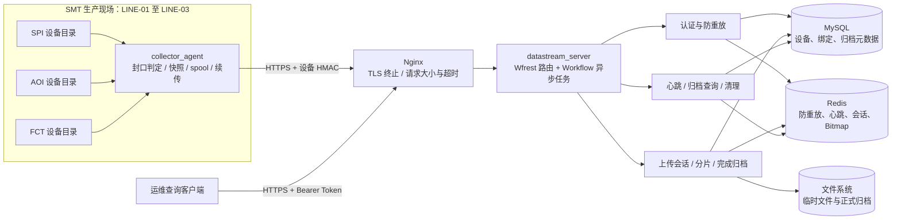

# SMT 检测工位数据采集与归档管理平台

这是一个面向 SMT 产线原始数据可靠采集与追溯的 C++11 项目。平台从三条产线的 SPI、AOI、
FCT 设备目录采集检测结果、测试报告、NG 图片、设备导出文件和运行日志，经设备认证、分片续传、
完整性校验后归档文件正文，并将可检索元数据写入 MySQL。

当前版本为 `v1.0.0`。项目的重点不是解析不同厂商文件内容，而是保证原始文件从设备侧产生到
服务端正式归档这一段链路可认证、可恢复、可校验、可查询。

## 1. 业务场景

仿真模型包含三条 SMT 生产线，每条线配置一台产线工控机和 SPI、AOI、FCT 三台设备：

| 设备/节点 | 主要数据 | 文件行为 |
|---|---|---|
| SPI | 焊膏检测 JSON、设备导出包 | 临时文件写完后原子改名 |
| AOI | 外观检测 JSON、NG 图片 | 文件分段写入，连续稳定后封口 |
| FCT | 功能测试 CSV、运行日志 | 正文关闭后产生同名 `.done` |
| IPC | 采集状态和运行记录 | 管理本线设备目录与本地 spool |

产线网络短暂中断时，Collector 先将不可变文件快照和任务状态持久化到本地 spool；网络恢复或
进程重启后继续查询服务端缺失分片并补传。平台不把大文件正文写入 MySQL，也不把 Redis 当作
最终归档事实来源。

项目明确不包含 Web 前端、PLC 控制、MES 排产、文件内容解析、日志全文检索、BM25 和 SLRU。
日志检索属于独立的 `02_SMT_LogTrace` 项目。

## 2. 系统架构



### 2.1 组件职责

| 组件 | 职责 |
|---|---|
| `collector_agent` | 扫描设备目录、判断文件封口、生成不可变快照、持久化任务状态并断点续传 |
| Nginx | 对外终止 TLS，限制请求体和超时，添加安全响应头；业务服务只监听回环地址 |
| `datastream_server` | 提供健康、心跳、上传、完成归档和历史查询 API，编排存储操作 |
| MySQL | 保存产线、工位、设备、IPC 绑定和正式归档元数据，是结构化查询事实来源 |
| Redis | 保存有 TTL 的防重放键、设备心跳、上传会话、分片摘要和 Bitmap |
| 文件系统 | 保存上传临时文件和正式归档正文；两个目录必须在同一文件系统 |

### 2.2 服务端模块

`include/datastream/` 与 `src/` 按相同职责组织：

| 模块 | 作用 |
|---|---|
| `api/` | Wfrest 路由、请求解析、统一响应和异步调用链组装 |
| `auth/` | SHA-256、HMAC-SHA256、设备认证、防重放和 Operator Token |
| `device/` | 设备/工位/产线状态、IPC 绑定和心跳模型 |
| `upload/` | 上传会话、配额、Redis Hash/Bitmap、分片写入与完成状态 |
| `archive/` | 窗口化哈希、原子归档、元数据持久化和稳定游标查询 |
| `collector/` | 采集配置、spool、HTTP 上传器和采集状态机 |
| `cleanup/` | 清理确定过期的会话和严格匹配的临时文件 |
| `storage/` | Workflow MySQL/Redis 客户端与存储路径约束 |
| `config/` | JSON 配置读取及启动边界的一次性严格校验 |
| `server/` | 服务初始化、路由注册、清理调度和停止流程 |
| `common/` | 至少被两个业务模块复用的时间、UUID、响应和校验基础能力 |

## 3. 核心数据链路

一个设备文件从产生到可查询会经过以下步骤：

1. 设备按原子改名、稳定窗口或 `.done` 标志完成封口；
2. Collector 读取 sidecar 元数据，计算 SHA-256，并将正文复制为不可变 spool 快照；
3. Collector 使用数据源设备身份构造 HMAC 请求，服务端校验时间窗口、正文摘要、设备状态、
   IPC 绑定和 Redis 防重放键；
4. 服务端校验文件类型、大小、磁盘水位和会话配额，使用 `posix_fallocate` 创建临时文件，
   Redis 保存会话与空 Bitmap；
5. Collector 查询缺片并上传；服务端使用 `pwrite` 写入固定偏移，成功后原子登记分片摘要和位图；
6. 完成请求冻结会话，服务端检查 Bitmap、文件大小，并以窗口化 `mmap` 计算整文件 SHA-256；
7. 校验通过后使用同文件系统 `rename` 进入正式目录，再写入 MySQL 唯一归档记录；
8. Operator 可按设备、工位、工单、产品 SN、文件类型、结果和 UTC 时间范围分页查询元数据。

Redis 会话丢失时，Collector 为同一本地任务创建新会话；完成响应丢失时，确定性归档路径与
MySQL 唯一约束保证重复完成返回同一个 `archive_id`，不会生成重复正式文件。

## 4. 对外接口

| 方法与路径 | 认证 | 用途 |
|---|---|---|
| `GET /health/live` | 无 | 进程存活检查 |
| `GET /health/ready` | 无 | MySQL、Redis 和存储就绪检查 |
| `POST /api/v1/devices/heartbeat` | 设备 HMAC | 上报设备状态、软件版本和工单 |
| `POST /api/v1/uploads` | 设备 HMAC | 创建上传会话 |
| `PUT /api/v1/uploads/{id}/chunks/{no}` | 设备 HMAC | 上传或幂等重传分片 |
| `GET /api/v1/uploads/{id}` | 设备 HMAC | 查询会话状态和缺失分片 |
| `POST /api/v1/uploads/{id}/complete` | 设备 HMAC | 校验并原子归档 |
| `GET /api/v1/archives` | Operator Token | 组合条件和游标分页查询 |
| `GET /api/v1/archives/{id}` | Operator Token | 查询单条完整归档元数据 |

精确字段、签名规范和错误码见 [HTTP API 契约](docs/06_API契约.md)，机器可读描述见
[OpenAPI 3.0](docs/07_openapi.yaml)。

## 5. 项目目录

```text
01_SMT_DataStream/
├── CMakeLists.txt           # C++11 构建、依赖、测试、覆盖率和 Sanitizer 选项
├── conf/                    # 开发/生产服务配置、Collector 配置和环境变量基线
├── data/                    # 已提交的固定模拟业务样本；运行时临时/归档目录不提交
├── deploy/                  # Nginx、systemd 和 logrotate 部署文件
├── docs/                    # 01～22 编号的设计、契约、报告、运维和面试文档
├── include/datastream/      # 各模块 C++ 公共与内部声明
├── migrations/              # MySQL 版本化迁移和本地开发种子
├── scripts/                 # 构建、迁移、运行、验收、覆盖率、备份等脚本
├── src/                     # 服务端和 Collector C++ 实现
├── tests/                   # 单元、基础设施集成、HTTP E2E 和固定负载测试
├── tools/                   # 固定业务数据与设备文件生命周期模拟器
└── logs/                    # 本地日志目录，仅保留 .gitkeep
```

各目录的具体内容：

| 目录 | 内容与使用方式 |
|---|---|
| `conf/` | `datastream.json` 用于本地开发，`datastream.production.json` 提供绝对生产路径，`collector.json` 描述三线九设备；两个 `.env` 文件只列出变量名和占位值，服务不会自动加载 |
| `data/mock_inbox/` | 可重复回归使用的 JSON、CSV、PNG、ZIP、LOG 和 manifest；不是正式归档目录 |
| `deploy/nginx/` | TLS 反向代理、请求体/超时和安全响应头 |
| `deploy/systemd/` | DataStream 与 Collector 的隔离账户、环境文件和可写目录约束 |
| `deploy/logrotate/` | 生产日志轮转策略 |
| `migrations/` | `000`～`002` 版本迁移；`dev_seed.sql` 生成三线设备和 IPC 绑定 |
| `scripts/` | `db.sh` 显式迁移，`build.sh` 构建，`acceptance.sh` 执行发布门禁，其他脚本负责质量、健康和备份 |
| `tests/unit/` | 不依赖本机服务的 GoogleTest 单元测试 |
| `tests/integration/` | 真实 Workflow MySQL/Redis 客户端成功与失败场景 |
| `tests/e2e/` | 启动真实 HTTP 服务，验证认证、上传、归档、查询、三线采集及故障恢复 |
| `tests/http_load/` | 可指定并发和到达率的心跳、查询固定负载工具 |
| `tools/` | 批量/持续模拟业务数据，以及原子改名、追加、完成标志和异常文件模拟 |

`build*`、`.cache`、Python 缓存、`logs/datastream.log`、`data/upload_tmp`、`data/archive`、
`data/device_inbox` 和 `data/collector_spool` 都是运行时可再生内容，已被 `.gitignore` 排除，
不属于源码交付。

## 6. 配置文件

| 文件 | 用途 |
|---|---|
| `conf/datastream.json` | 本地开发服务配置，使用相对数据和日志目录、Redis `default` 用户和 `smt:dev:` 前缀 |
| `conf/datastream.production.json` | systemd 部署基线，使用 `/var/lib`、`/var/log` 和 `smt:prod:` 前缀 |
| `conf/collector.json` | 三线九设备目录、IPC 绑定、封口方式、spool 和重试参数 |
| `conf/datastream.env` | MySQL 密码和 Operator Token 的环境变量名称与占位值 |
| `conf/collector.env` | 九台设备密钥的环境变量名称与占位值 |

配置 JSON 会在进程启动时严格校验未知字段、类型、范围和关联约束。密码、设备密钥和 Token
只能由环境变量或部署系统注入，不能填写到 JSON 或日志中。当前本机 Redis 保持无密码
`default` 用户；项目不会创建 `root` Redis 用户。

## 7. 构建与运行

### 7.1 依赖

- GCC/G++、CMake 3.16+
- Workflow、Wfrest
- OpenSSL、spdlog、nlohmann/json
- MySQL、Redis 及其命令行客户端
- GoogleTest；质量验收还使用 clang-format、clang-tidy、lcov 和 Valgrind

CMake 找不到依赖时直接失败，不在配置阶段联网下载替代版本。

### 7.2 IDE 索引

项目根目录的 `.clangd` 指定使用 `build/compile_commands.json`。CMake 配置时会在该文件中
生成每个翻译单元的绝对 include 路径、宏和 C++ 标准，clangd 据此解析
`#include "datastream/..."`。`build/` 是被 Git 忽略的本机开发元数据，不属于源码交付，
但使用 IDE 开发时应保留。

如果 IDE 在配置前已经缓存了错误，重新加载项目或重启语言服务。推荐让 IDE 打开
`01_SMT_DataStream` 目录，然后至少执行一次：

```bash
cmake -S . -B build -DCMAKE_BUILD_TYPE=Debug
```

### 7.3 本地构建

```bash
cmake -S . -B build \
  -DCMAKE_BUILD_TYPE=Debug \
  -DDATASTREAM_BUILD_TESTS=ON \
  -DDATASTREAM_ENABLE_INTEGRATION_TESTS=ON
cmake --build build --parallel 2
```

也可使用：

```bash
scripts/build.sh debug
scripts/build.sh release
```

### 7.4 初始化数据库

```bash
export SMT_DATASTREAM_MYSQL_PASSWORD='<mysql-password>'
export SMT_DATASTREAM_OPERATOR_TOKEN='<at-least-16-characters>'
scripts/db.sh migrate --config conf/datastream.json
scripts/db.sh seed --config conf/datastream.json
```

迁移脚本保存 SQL 文件 SHA-256，已执行版本被修改后会明确停止。服务启动时不会自动修改表结构；
生产环境只执行 `migrate`，不执行 `dev_seed.sql`。

### 7.5 启动服务

```bash
./build/datastream_server --config conf/datastream.json
```

另一个终端执行：

```bash
curl -i http://127.0.0.1:8080/health/live
curl -i http://127.0.0.1:8080/health/ready
```

### 7.6 启动 Collector

先创建 `conf/collector.json` 中配置的九个设备输入目录，并通过环境变量提供对应设备密钥：

```bash
./build/collector_agent --config conf/collector.json
```

设备 sidecar 字段和三种封口方式见
[采集端与文件生命周期契约](docs/08_采集端与文件生命周期契约.md)。

## 8. 模拟业务数据

生成可重复的三线样本：

```bash
python3 tools/generate_mock_data.py --cycles 12 --seed 20260711
```

持续模拟设备产出：

```bash
python3 tools/generate_mock_data.py --continuous --interval-seconds 5
```

生成 Collector 使用的文件生命周期和异常场景：

```bash
python3 tools/simulate_device_lifecycle.py \
  --root data/device_inbox \
  --include-anomalies
```

文件类型、目录和 manifest 说明见 [模拟原始业务数据说明](data/README.md)。

## 9. 测试与发布门禁

不访问 MySQL/Redis 的测试：

```bash
ctest --test-dir build -LE integration --output-on-failure
```

全量测试需要本机 MySQL、Redis 以及上述两个服务端环境变量：

```bash
ctest --test-dir build --output-on-failure
```

一键执行迁移、Debug/Release、54 项 CTest、格式、静态检查、覆盖率、Sanitizer 和 Valgrind：

```bash
scripts/acceptance.sh
```

终板已验证：54/54 全量测试、核心源码 81.8% 行覆盖率、ASan/UBSan 无报告、Valgrind 0 errors，
以及三线 18 个有效文件归档、2 个异常文件隔离、Collector 强退和 Redis 会话丢失恢复。完整证据见
[终板验收报告](docs/16_第六期暨终板验收报告.md)。

## 10. 部署与运维

生产链路为 `Collector -> Nginx TLS -> datastream_server`。systemd 单元使用独立的
`smt-collector` 与 `smt-datastream` 账户，配置和密钥文件位于 `/etc/smt-datastream`，正文与
spool 位于 `/var/lib`。详细安装、权限、迁移、备份恢复和升级回滚步骤见
[部署与运维手册](docs/17_部署与运维手册.md)。

固定故障演练包含 MySQL/Redis 短暂不可用、磁盘低水位、DataStream/Collector 强退、Redis 会话
丢失和重复完成，见 [故障演练与排查](docs/18_故障演练与排查.md)。

## 11. 文档阅读顺序

文档文件名已经按推荐阅读顺序编号：

1. [01_开发思路](docs/01_开发思路.md)
2. [02_模拟业务基线](docs/02_模拟业务基线.md)
3. [03_实际业务差距与改进思路](docs/03_实际业务差距与改进思路.md)
4. [04_编码前准备](docs/04_编码前准备.md)
5. [05_数据与状态模型](docs/05_数据与状态模型.md)
6. [06_API契约](docs/06_API契约.md)
7. [07_OpenAPI](docs/07_openapi.yaml)
8. [08_采集端与文件生命周期契约](docs/08_采集端与文件生命周期契约.md)
9. [09_分期实施计划](docs/09_分期实施计划.md)
10. [10_本机环境检查](docs/10_本机环境检查.md)
11. [11_第一期开发报告](docs/11_第一期开发报告.md)
12. [12_第二期开发报告](docs/12_第二期开发报告.md)
13. [13_第三期开发报告](docs/13_第三期开发报告.md)
14. [14_第四期开发报告](docs/14_第四期开发报告.md)
15. [15_第五期开发报告](docs/15_第五期开发报告.md)
16. [16_第六期暨终板验收报告](docs/16_第六期暨终板验收报告.md)
17. [17_部署与运维手册](docs/17_部署与运维手册.md)
18. [18_故障演练与排查](docs/18_故障演练与排查.md)
19. [19_核心调用链与面试演示](docs/19_核心调用链与面试演示.md)
20. [20_简历能力与代码证据矩阵](docs/20_简历能力与代码证据矩阵.md)
21. [21_学习与面试准备路线](docs/21_学习与面试准备路线.md)
22. [22_面试回答参考](docs/22_面试回答参考.md)

仓库级生成和修改规则见根目录 `agent.md`，C++ 注释要求见根目录 `代码注释规范.md`。
