# SMT 检测设备日志索引与故障检索系统完整技术说明

## 1. 文档说明

本文基于 `02_SMT_LogTrace` 当前 `v1.0.0` 代码、配置、数据库迁移、测试和部署资产，完整说明项目的
业务背景、系统边界、架构、数据模型、索引构建、检索算法、缓存、故障处理和运维方式。

项目使用 C++11 开发，核心技术包括 Linux、Workflow/Wfrest、SRPC、Protobuf、MySQL、Redis、
倒排索引、BM25、Top-K、SLRU、POSIX `pread`、CMake 和 OpenSSL。

## 2. 项目目标

SMT 检测工位、功能测试台和产线工控机会持续产生运行日志、报警日志和测试记录。原始文件虽然已经
归档，但如果没有统一索引，工程师排查历史故障时仍需要按日期、设备和目录逐个查找文件，再使用
文本工具搜索，效率较低。

本项目在一期“SMT 检测工位数据采集与归档管理平台”之上提供以下能力：

- 增量发现新归档；
- 校验并解析运行日志和测试报告；
- 按批次构建不可变倒排索引；
- 按关键词、设备、工位、工单、产品 SN、等级、模块、错误码和时间检索；
- 使用 BM25 和业务权重进行相关性排序；
- 查询异常日志和错误码知识；
- 根据索引中的字节范围回读原始日志；
- 使用本地 SLRU 和 Redis 减少重复计算及文件访问。

项目解决的是“已归档日志如何快速检索和辅助排障”，不负责设备认证、文件上传和正式归档。

## 3. 与一期 DataStream 的边界

一期 DataStream 是归档数据的生产者，LogTrace 是只读消费者。

| 事项 | DataStream | LogTrace |
|---|---|---|
| 设备身份认证 | 负责 | 不负责 |
| HMAC、防重放 | 负责 | 不负责 |
| 分片上传、断点续传 | 负责 | 不负责 |
| 文件大小和 SHA-256 首次校验 | 负责 | 读取前再次校验 |
| 正式归档写入 | 负责 | 只读 |
| `archive_file` 元数据 | 负责写入 | 只读消费 |
| 日志解析和全文检索 | 不负责 | 负责 |
| 倒排索引、BM25、Top-K | 不负责 | 负责 |
| 查询缓存 | 不负责 | 负责 |

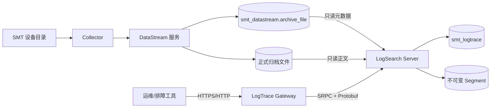

二期使用独立的 `smt_logtrace` 数据库。配置加载时会拒绝源库和状态库指向同一个数据库，避免二期
误写一期业务库。生产环境应给源库账号只读权限。

## 4. 业务数据与文档粒度

### 4.1 支持的数据来源

当前只索引一期归档中的两类文件：

| 文件类型 | 解析方式 | 文档粒度 |
|---|---|---|
| `RUNTIME_LOG` | `kv_runtime_v1` | 一条物理日志行 |
| `TEST_REPORT` | `fct_csv_v1` | 一个测试点记录 |

检测结果、NG 图片、设备导出包等文件仍由一期保存，但不会被二期当成文本日志索引。

### 4.2 文档结构化字段

每个检索文档包含：

- `archive_id`；
- 文件内 `byte_offset`、`byte_length`；
- 日志发生时间和归档时间；
- 产线、工位、设备、Collector；
- 工单、产品 SN；
- 来源类型；
- 日志等级；
- 模块名、错误码、事件名；
- 分词后的词数。

正文不写入 MySQL，也不重复写入 Segment 的文档表。Segment 只保存结构化字段和定位信息。

### 4.3 异常记录定义

当前实现把以下记录视为异常：

- 等级为 `WARN`；
- 等级为 `ERROR`；
- 错误码非空；
- FCT 测试点被解析为 NG 后形成的异常文档。

不同来源仍保留各自的 `source_type`，测试点失败不会被伪装成设备运行日志。

## 5. 总体架构

项目包含三个可执行程序：

| 程序 | 职责 |
|---|---|
| `logsearch_server` | 增量索引、Segment 管理、查询快照、搜索、缓存和 SRPC 服务 |
| `logtrace_gateway` | HTTP 路由、Operator 鉴权、参数校验、RPC 调用和错误映射 |
| `logtrace_admin` | 单次扫描、单次构建和指定归档重建 |

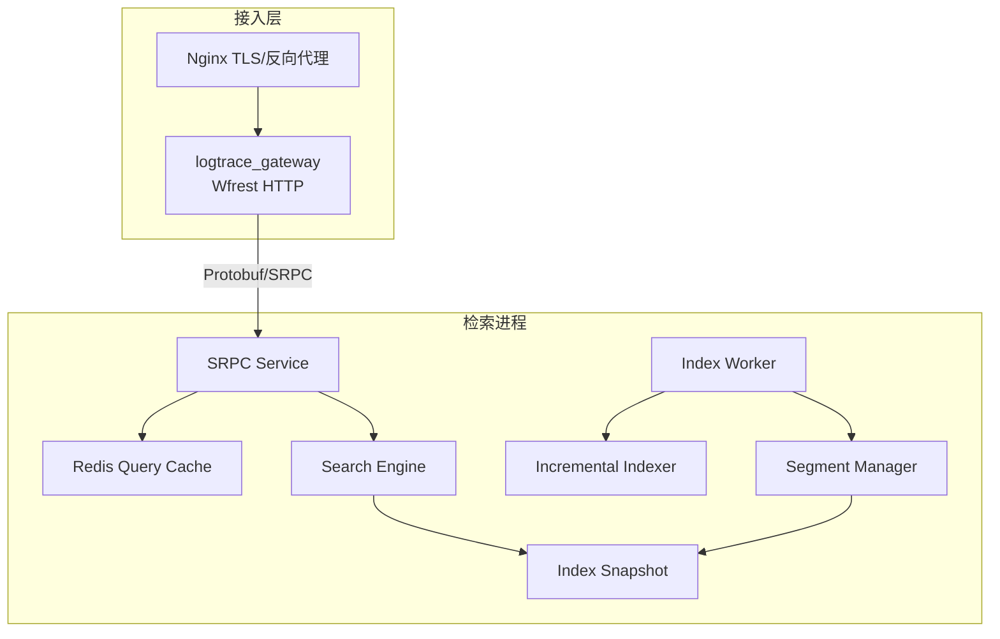

### 5.1 为什么拆分 Gateway 和 Search Server

Gateway 面向外部协议，负责请求体、URL、鉴权和 HTTP 错误语义；Search Server 持有较大的索引快照，
负责 CPU 密集型查询和后台索引构建。拆分后：

- HTTP 协议变化不会直接进入索引模块；
- Search Server 可以只监听内部 RPC；
- 两个进程可以分别观测和重启；
- RPC 层能够统一表达网络错误、超时和业务错误。

项目没有继续拆分更多微服务，因为当前单机业务规模下，索引构建和查询共享状态及文件布局，进一步
拆分会增加发布协调成本。

## 6. 启动与生命周期

### 6.1 Search Server 启动

`LogSearchServer::initialize()` 按以下顺序执行：

1. 初始化和验证归档目录、索引目录；
2. 探测一期 MySQL；
3. 探测二期状态 MySQL；
4. 探测 Redis；
5. 恢复未完成的解析状态；
6. 恢复 BUILDING 批次并加载全部 READY Segment；
7. 构造完整查询快照。

任一必要依赖不可用，或者 READY Segment 缺失、摘要错误时，Search Server 拒绝启动。

启动 SRPC 监听成功后，`IndexWorker` 才启动后台轮询。停止时先停止后台工作线程，再停止 RPC，避免
对象析构期间仍有索引任务访问依赖。

### 6.2 Gateway 启动

Gateway 构造时注册健康和业务路由，并设置最大请求体。启动 HTTP 监听前会同步调用 Search Server
健康接口。Search Server 未就绪时 Gateway 拒绝启动。

### 6.3 推荐启动顺序

```text
MySQL / Redis
    -> DataStream
    -> logsearch_server
    -> logtrace_gateway
    -> Nginx
```

## 7. 严格配置系统

配置通过 JSON 和环境变量共同加载。JSON 保存非敏感连接和容量参数，密码与 Operator Token 只保存
环境变量名称。

### 7.1 配置分区

| 分区 | 主要内容 |
|---|---|
| `gateway` | HTTP 地址、端口、请求上限、RPC 地址、RPC 超时、Token 环境变量 |
| `search_rpc` | Search Server 监听地址和端口 |
| `source_mysql` | 一期只读元数据库连接 |
| `state_mysql` | 二期状态数据库连接 |
| `redis` | Redis 连接、认证和 Key 前缀 |
| `storage` | 一期归档根目录、二期索引根目录 |
| `health` | 依赖探测超时 |
| `indexing` | 轮询周期、批次文件/文档上限、最大行长度 |
| `cache` | SLRU 容量、正文缓存上限、活跃窗口和四类 TTL |
| `logging` | 日志等级、文件、轮转大小和数量 |

### 7.2 校验原则

配置加载采用严格字段集合：缺字段或出现未知字段都会失败。还会校验端口、容量、超时、环境变量名、
日志文件冲突以及源库/状态库不能相同等关联约束。

服务不会主动读取 `logtrace.env`；部署脚本或 systemd 负责把环境变量注入进程。

## 8. MySQL 数据模型

### 8.1 `schema_migration`

记录迁移版本、SQL 文件 SHA-256 和执行时间。已经执行的迁移文件如果被修改，`db.sh` 会停止执行，
要求通过新迁移演进数据库。

### 8.2 `index_batch`

记录一个增量批次的范围和生命周期：

- `batch_id`；
- 首尾 `archive_id`；
- 当前状态；
- 源文件数、文档数；
- PARSED 工件路径和摘要；
- Segment 名称和摘要；
- 失败码、创建时间、发布时间。

有效状态包括：

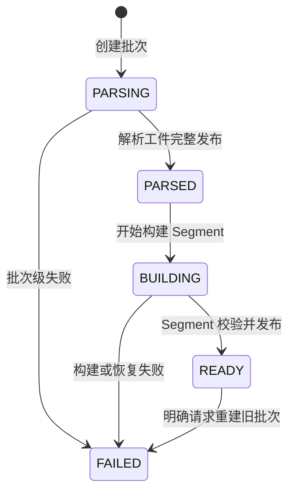

数据库 CHECK 约束要求 PARSED、BUILDING、READY 状态必须保留解析工件定位；READY 还必须具备
Segment 名称、摘要和发布时间。

### 8.3 `indexed_archive`

按 `archive_id` 记录每个一期归档的消费结果：

- 所属批次；
- 解析器及版本；
- `PENDING`、`PARSED`、`INDEXED`、`FAILED` 状态；
- 文档数；
- 失败码和失败行号；
- 索引时间。

坏文件只影响自身记录，批次中的其他有效文件仍可继续处理。

### 8.4 `parser_profile`

以 `(device_id, file_type)` 为主键，指定允许使用的解析器。当前支持：

- `kv_runtime_v1`；
- `fct_csv_v1`。

未知设备/文件类型组合不会根据正文猜测格式，而是记录明确失败。

### 8.5 `error_code_catalog`

保存错误码、模块、标题、说明、建议动作和启用状态。错误码知识长期保存于 MySQL，本地 SLRU 缓存
热点记录；与错误码匹配的日志仍从当前索引快照查询。

## 9. 增量扫描与解析

### 9.1 增量游标

系统按一期 `archive_file.archive_id` 增量扫描，而不是按时间字段扫描。`archive_id` 是单调递增主键，
不会因相同时间或设备时间漂移造成边界重复和遗漏。

扫描只选择 `RUNTIME_LOG` 和 `TEST_REPORT`，并受以下上限控制：

- 单批最多源文件数；
- 单批最多文档数；
- 先达到任一上限即结束当前批次。

### 9.2 单文件解析流程

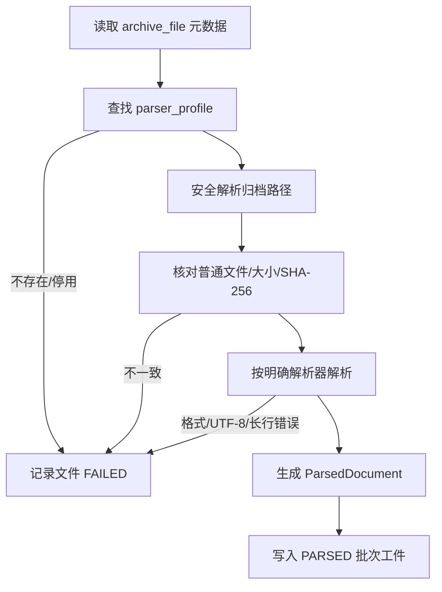

### 9.3 运行日志解析

`kv_runtime_v1` 以一条物理日志行为一个文档，解析 ISO 8601 时间和固定 KV 字段。解析器验证：

- UTF-8；
- 最大行长度；
- 时间格式；
- 设备、工位等字段与归档元数据的一致性；
- CRLF 和精确字节范围。

### 9.4 FCT CSV 解析

`fct_csv_v1` 先读取报告级元数据，再把每个测试点转换为文档。CSV 解析支持 BOM、CRLF、带逗号的
引号字段，并验证报告内设备、工单、SN 等事实与一期元数据一致。

### 9.5 文件级原子失败

一个文件只有完整解析成功后，其全部文档才进入 PARSED 工件。中途遇到非法行时，不会保留文件前半
部分文档，避免查询出现不完整文件视图。

## 10. PARSED 工件

解析阶段先发布结构化中间工件，而不是直接写 Segment。目录布局为：

```text
index_root/parsed/batch_<batch_id>/
├── manifest.json
├── archives.jsonl
└── documents.jsonl
```

- `manifest.json`：批次范围、计数、子文件大小和 SHA-256；
- `archives.jsonl`：成功归档、解析器版本和文件元数据；
- `documents.jsonl`：局部文档编号和结构化字段。

PARSED 工件不复制原始正文。发布后，MySQL 批次进入 `PARSED`，等待 Segment 构建。

中间工件的作用是把“外部文件解析”和“索引二进制构建”分开，便于失败定位、重启恢复和明确重建。

## 11. 不可变 Segment

### 11.1 目录布局

```text
index_root/segments/segment_<batch_id>/
├── manifest.json
├── terms.bin
├── postings.bin
├── documents.bin
└── files.bin
```

四个二进制文件采用固定小端格式、显式版本头和长度字段。

### 11.2 Term 和 Posting

`terms.bin` 中每个词项包含：

- term 字符串；
- 文档频率 DF；
- Posting 起始位置；
- Posting 数量。

`postings.bin` 中每条 Posting 包含：

- Segment 内 `local_id`；
- 该词在文档中的词频 TF。

### 11.3 Document 和 File

`documents.bin` 保存结构化元数据、文件序号、offset、length 和 term_count。

`files.bin` 保存 archive_id、文件大小、文件 SHA-256 和一期相对路径。多个文档通过 `file_ordinal`
引用同一条文件记录。

### 11.4 doc_id

稳定 doc_id 由批次编号和局部文档编号组成：

```text
doc_id = (batch_id << 32) | local_id
```

高 32 位定位批次，低 32 位定位 Segment 内文档。重建会形成新批次和新 doc_id，避免新旧文档编号
混淆。

### 11.5 原子发布

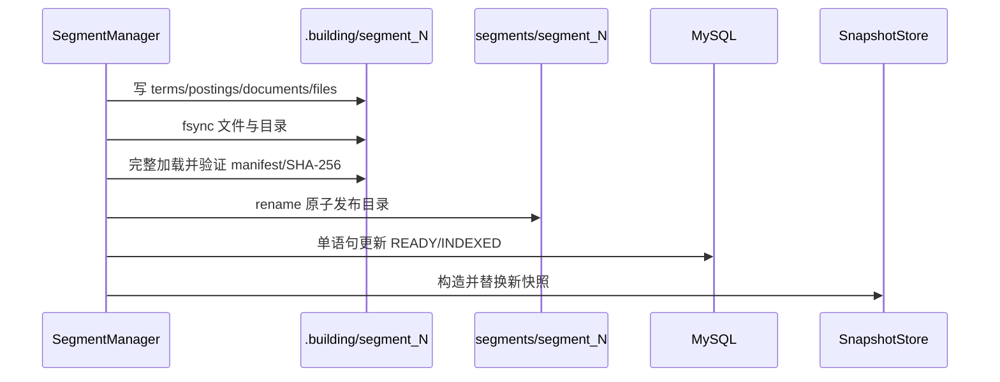

顺序保证：

- 未完成目录不进入查询；
- 数据库不会在文件发布前声明 READY；
- 内存快照不会在数据库发布前包含新 Segment；
- 查询线程始终持有完整旧快照或完整新快照。

## 12. 恢复与重建

### 12.1 启动恢复

Search Server 启动时：

- 清理或处理 `.building` 临时目录；
- 恢复文件已经正式发布但数据库仍为 BUILDING 的批次；
- 忽略没有数据库 READY 事实的孤儿正式目录；
- 加载并验证全部 READY Segment；
- 任一 READY Segment 损坏时拒绝启动。

### 12.2 显式重建

运维命令：

```bash
./build/logtrace_admin --config conf/logtrace.json rebuild --archive-id 123
```

重建按原批次处理，旧批次进入明确失败状态并移除旧工件，归档重新参与后续扫描和构建。系统不会在
后台静默猜测并修复损坏索引。

### 12.3 跨进程互斥

Search Server 与 `logtrace_admin` 通过 `index_root/.indexer.lock` 串行修改索引状态，防止后台工作
线程和管理命令同时发布 Segment。

## 13. 查询快照

`IndexSnapshot` 是按 batch_id 升序排列的一组不可变 `LoadedSegment`。快照版本定义为当前最大 READY
batch_id；空快照版本为 0。

`IndexSnapshotStore` 使用短互斥锁替换 `shared_ptr`：

- 查询开始时取得当前快照 shared_ptr；
- 查询期间始终使用该对象；
- 发布线程完整构造新快照后替换全局指针；
- 已开始查询继续使用旧快照；
- 最后一个旧查询结束后旧快照自动释放。

这种方式避免用长时间读写锁包围整个搜索过程。

## 14. 分词与查询规范化

索引构建和查询使用同一 `term_tokenizer`，保证词项语义一致。主要行为包括：

- ASCII 字母转为小写；
- 保留工业标识符所需字符；
- 文档侧保留重复词用于 TF 和文档长度；
- 查询侧对规范化 term 去重；
- 多个输入关键词最终形成 term 集合。

关键词搜索使用 AND 语义：文档必须包含所有 term。

## 15. 搜索条件与边界

`SearchQuery` 支持：

- 关键词；
- 产线、工位、设备；
- 工单、产品 SN；
- INFO/WARN/ERROR 等级集合；
- 模块名、错误码；
- 发生时间范围；
- 异常日志模式；
- offset 和 page_size。

主要限制：

- 最多 8 个关键词；
- 单关键词最长 64 字节；
- `page_size` 为 1 至 200；
- `offset + page_size <= 1000`；
- 时间范围最长 31 天；
- 没有设备、工单、产品 SN 或错误码等精确条件时必须提供时间范围。

Gateway 完成 HTTP 边界校验，Search Server 再验证 RPC 契约，避免内部 RPC 被错误调用。

## 16. 低 DF 优先 AND 查询

### 16.1 DF

DF 是包含某个 term 的文档数量。DF 越小，Posting 越短，过滤能力通常越强。

### 16.2 执行流程

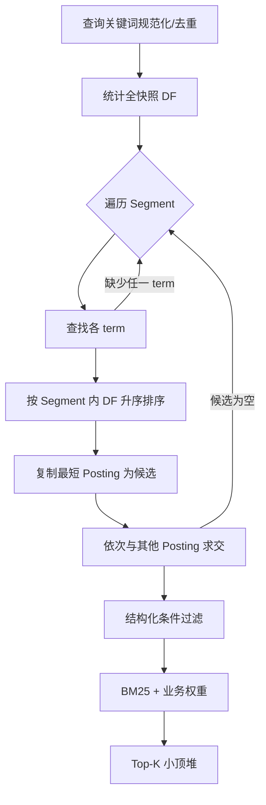

Posting 按 local_id 有序，集合求交不会改变结果，只减少中间候选数量。

## 17. BM25 和业务排序

### 17.1 BM25

当前参数：

```text
k1 = 1.2
b  = 0.75
```

实现使用全快照文档数、跨 Segment DF 和全局平均文档长度。单词项得分可概括为：

```text
IDF(term) * TF 饱和项 / 文档长度归一化项
```

含义：

- term 在当前文档出现越多，得分提高但逐渐饱和；
- term 在全局越少见，区分度越高；
- 通过文档长度归一化，避免长日志天然占优。

### 17.2 业务权重

在 BM25 基础上叠加：

- 查询错误码精确匹配：`+3.0`；
- 查询模块精确匹配：`+1.5`；
- ERROR：`+2.0`；
- WARN：`+1.0`。

这些是明确、可解释的排障规则，不是机器学习模型。当前参数是工程基线，没有宣称经过真实工厂人工
标注调优。

### 17.3 稳定排序

结果比较顺序：

1. 分数降序；
2. 发生时间降序；
3. doc_id 降序。

同一查询和同一快照能够得到稳定结果。

## 18. Top-K 与分页

若总命中为 n，页面只需要前 k 条，完整排序成本为 `O(n log n)`。项目使用小顶堆，仅保留
`offset + page_size` 个最佳候选，复杂度约为：

```text
O(n log k)
```

堆顶是当前保留结果中最差的一条。新候选更优时替换堆顶。扫描结束后再对堆内有限结果做稳定排序，
最后截取 offset 对应页面。

最大结果窗口限制为 1000，防止深分页无限放大堆容量和扫描成本。

## 19. 日志详情与 pread

详情查询流程：

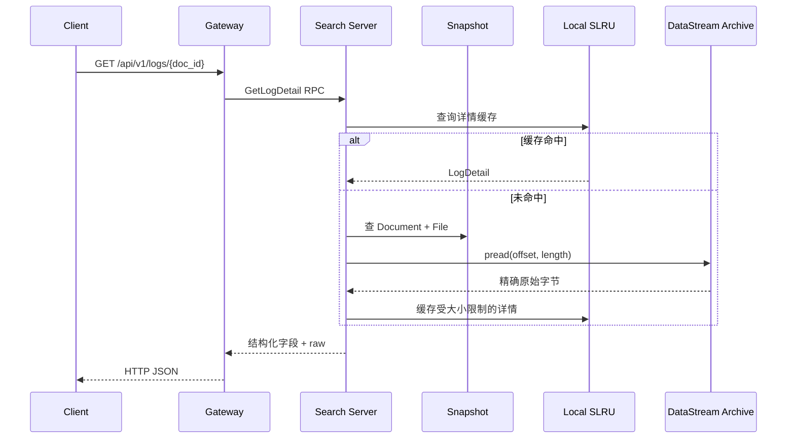

使用 `pread` 的原因：

- 调用时显式指定 offset；
- 不修改共享文件偏移；
- 并发读取无需围绕 `lseek + read` 加锁；
- 适合读取一小段精确记录。

实现循环处理短读和 `EINTR`。归档相对路径还要经过路径穿越、符号链接逃逸、普通文件和根目录边界
检查。

## 20. 本地 SLRU 缓存

### 20.1 缓存内容

- 日志详情；
- 文件元数据；
- 错误码知识。

详情和文件元数据 Key 包含快照版本。错误码知识不依赖索引快照。

### 20.2 算法

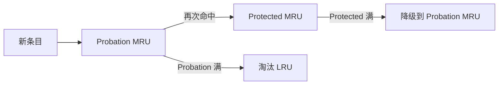

新条目不能直接进入 Protected，避免一次性历史扫描污染热点缓存。

### 20.3 数据结构与线程安全

模板 `SlruCache<Key, Value>` 使用：

- 两个 `std::list<Key>` 保存分区 LRU 顺序；
- `std::unordered_map` 定位值、链表迭代器和所属分区；
- 一个 `std::mutex` 保护查找、移动、晋升、降级和淘汰的完整原子过程。

容量按条目数配置。日志正文还受 `max_detail_bytes` 限制，超大详情不会进入本地缓存。

## 21. Redis 查询缓存

### 21.1 缓存内容

Redis 值为带格式版本的 JSON，包含：

- `snapshot_version`；
- `total_hits`；
- 当前页 `doc_ids`；
- 与 ID 一一对应的 `scores`。

Redis 不保存日志正文。

### 21.2 Key

```text
<key_prefix>query:v1:<snapshot_version>:<sha256(normalized_query)>
```

规范化内容包含：

- 分词、去重后的关键词；
- 排序后的等级集合；
- 全部结构化过滤条件；
- 时间范围；
- 查询类型；
- offset 和 page_size。

SHA-256 避免 Key 过长，也避免直接暴露查询正文。

### 21.3 快照版本

新 READY Segment 发布后，相同条件可能得到新结果。快照版本进入 Key 后：

- 新快照使用新 Key；
- 旧结果不会污染新快照；
- 旧 Key 按 TTL 自然过期；
- 不需要在线扫描 Redis 批量删除。

### 21.4 TTL

最近两小时为活跃时间段：

| 查询类型 | 默认 TTL |
|---|---:|
| 活跃非空结果 | 30 秒 |
| 活跃空结果 | 10 秒 |
| 历史非空结果 | 600 秒 |
| 历史空结果 | 300 秒 |

空结果缓存用于减少重复无效查询，但 TTL 更短，以便新日志较快可见。

### 21.5 Cache-Aside 流程

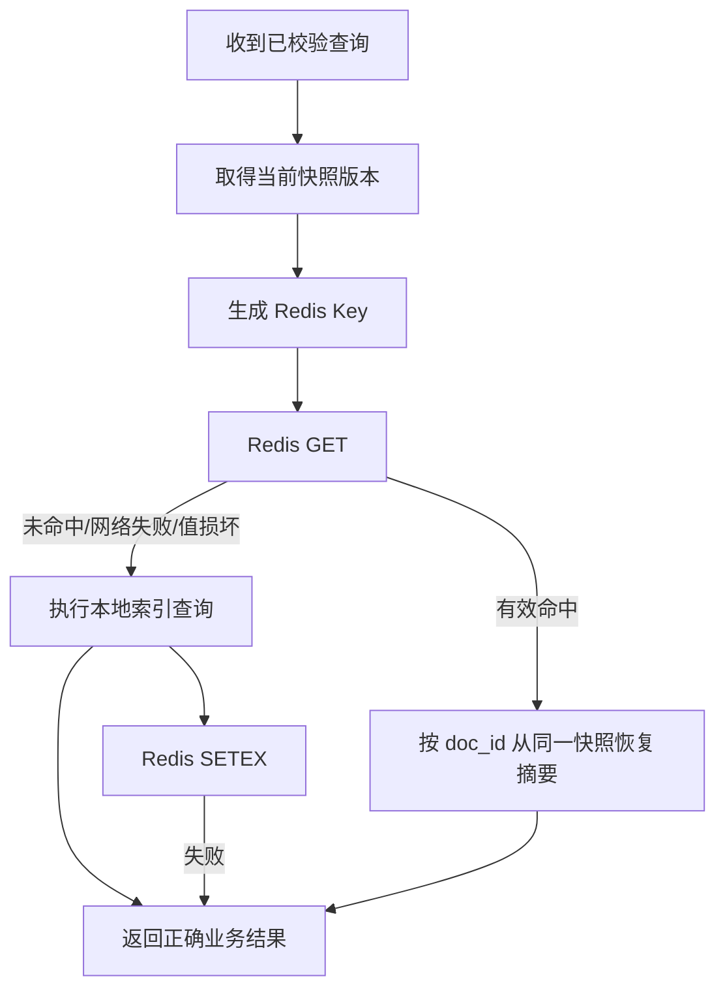

Redis 故障只影响性能，不影响查询正确性。实现不进行 Redis 重试。

## 22. HTTP 接口

所有 `/api/v1` 业务接口要求：

```text
Authorization: Bearer <SMT_LOGTRACE_OPERATOR_TOKEN>
```

Token 使用 OpenSSL `CRYPTO_memcmp` 做常量时间比较。

### 22.1 关键词搜索

```http
POST /api/v1/logs/search
```

请求示例：

```json
{
  "keywords": ["inspection", "ng"],
  "device_id": "AOI-VT-01",
  "levels": ["ERROR"],
  "occurred_from": "2026-07-13T00:00:00.000Z",
  "occurred_to": "2026-07-14T00:00:00.000Z",
  "offset": 0,
  "page_size": 50
}
```

### 22.2 异常日志

```http
GET /api/v1/logs/anomalies?...&offset=0&page_size=50
```

使用结构化条件查询 WARN、ERROR 或带错误码的记录。

### 22.3 日志详情

```http
GET /api/v1/logs/{doc_id}
```

返回摘要、archive_id、offset、length 和精确原始内容。

### 22.4 错误码知识

```http
GET /api/v1/error-codes/{code}
```

返回错误码标题、说明、建议动作和最近五条匹配日志。

## 23. SRPC 与 Protobuf

内部服务 `LogSearchService` 定义：

- `Health`；
- `SearchLogs`；
- `ListAnomalies`；
- `GetLogDetail`；
- `GetErrorCode`。

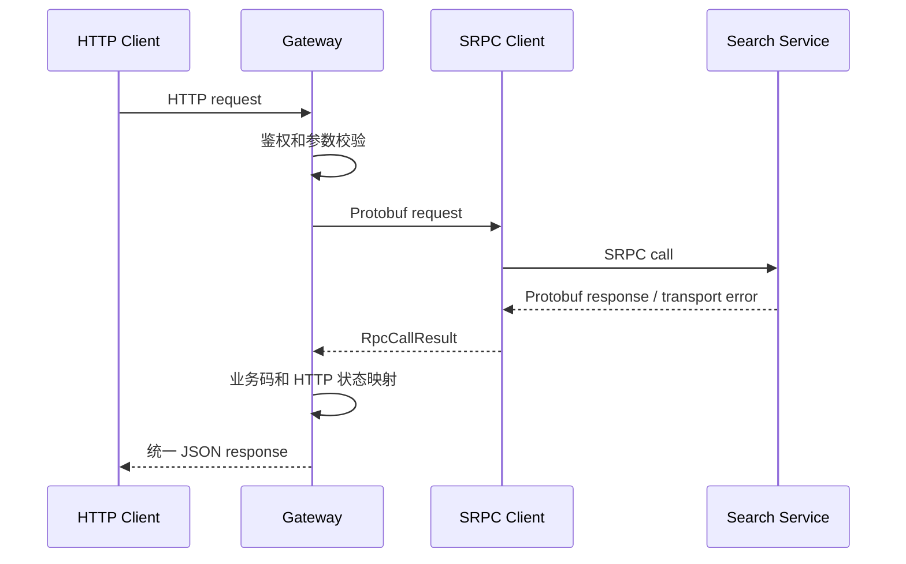

### 23.1 传输错误映射

- RPC 连接、网络或协议错误：HTTP 502；
- RPC 超时：HTTP 504；
- 参数错误：HTTP 400；
- Token 错误：HTTP 401；
- 日志或错误码不存在：HTTP 404；
- 索引损坏：HTTP 500；
- MySQL 不可用：HTTP 503；
- 原文读取失败：HTTP 500。

## 24. 健康检查

Gateway 提供：

- `/health/live`：进程是否响应；
- `/health/ready`：Search Server 和依赖是否就绪。

Search Server 的 Health RPC 异步检查：

- 一期 MySQL；
- 二期 MySQL；
- Redis；
- 归档和索引目录。

健康状态和业务查询降级策略不同：运行期 Redis 不可用时 readiness 会失败，但搜索请求仍可回退本地
索引获得正确结果。

## 25. 后台索引工作线程

`IndexWorker` 按配置周期执行：

1. 增量扫描和解析；
2. 构建下一个 PARSED 批次；
3. 发布 READY Segment 和新快照；
4. 等待下一个轮询周期。

工作线程支持安全启动、停止和 join。管理命令用于本机验收或运维显式操作，不需要暂停业务查询。

## 26. 管理命令

### 26.1 单次扫描

```bash
./build/logtrace_admin --config conf/logtrace.json scan-once
```

输出是否创建批次、批次 ID、源文件数、成功/失败数和文档数。

### 26.2 单次构建

```bash
./build/logtrace_admin --config conf/logtrace.json build-once
```

输出 Segment 名称、文档/Term/Posting 数，以及构建后的快照信息。

### 26.3 重建归档

```bash
./build/logtrace_admin --config conf/logtrace.json rebuild --archive-id 123
```

归档必须已有解析状态。命令只负责排队重建，不会修改一期元数据或正文。

## 27. 错误处理原则

项目遵循以下原则：

- 外部 HTTP、RPC、数据库、Redis、文件系统返回值在边界校验；
- 不用空值或默认成功掩盖错误；
- 不加入通用自动重试；
- 缓存失败可恢复时回到正确数据源；
- READY 索引无法证明完整时明确失败；
- 单文件解析错误隔离，不阻塞其他有效文件；
- 日志不输出密码、Token、查询正文或原始敏感内容。

## 28. 典型故障场景

### 28.1 Redis 不可用

- readiness 变为未就绪；
- 查询直接执行本地索引；
- 当前结果仍正确；
- 恢复后新查询重新写缓存。

### 28.2 状态 MySQL 不可用

- 启动时拒绝启动；
- 运行期错误码首次查询、新批次状态和发布受影响；
- 不伪造成功状态。

### 28.3 Segment 损坏

- READY Segment 加载失败；
- Search Server 拒绝启动；
- 运维核对一期归档后执行显式重建。

### 28.4 原始归档缺失

- 已加载索引仍可能返回摘要；
- 详情回读返回 `STORAGE_IO_ERROR`；
- 从一期备份恢复正文；
- 二期不生成替代内容。

### 28.5 构建中断

- 旧快照继续查询；
- `.building` 不可见；
- 重启后按数据库状态和文件校验恢复。

## 29. 安全设计

- 业务 HTTP 使用部署级 Bearer Token；
- Token、MySQL 密码和可选 Redis 密码来自环境变量；
- 配置与错误信息不输出敏感值；
- Operator Token 常量时间比较；
- 归档路径执行真实路径边界校验；
- Search Server 对一期数据库和归档目录只读；
- Nginx 终止 TLS，Gateway 监听本机地址；
- systemd 使用 `NoNewPrivileges`、`ProtectSystem`、`ProtectHome` 和受限读写目录。

当前 Token 是部署级凭据，不是用户系统，没有实现 RBAC。

## 30. 日志与可观测性

Gateway 和 Search Server 使用独立日志文件，支持等级、单文件大小和保留数量配置。HTTP 请求生成随机
request_id，并通过 Protobuf 传递给 Search Server，便于关联两侧调用日志。

运维主要观察：

- live/ready 健康状态；
- `index_batch` FAILED/BUILDING 状态；
- `indexed_archive` 文件失败码；
- READY Segment 校验失败；
- RPC 超时和连接失败；
- Redis 查询缓存状态；
- 归档和索引磁盘空间。

## 31. 构建系统

CMake 项目版本为 `1.0.0`，固定 C++11。主要依赖：

- OpenSSL；
- Protobuf；
- SRPC；
- Workflow；
- Wfrest；
- nlohmann/json；
- spdlog；
- GoogleTest；
- Zlib、Snappy、LZ4。

构建时自动运行 `protoc` 和 `srpc_generator` 生成 Protobuf/SRPC 文件。

生产代码启用：

```text
-Wall -Wextra -Wpedantic -Werror
```

支持 Debug、Release、覆盖率和 ASan/UBSan 构建。

## 32. 测试体系

### 32.1 单元测试

覆盖：

- 配置严格校验；
- 时间、URI、请求 ID；
- 两类解析器及边界；
- PARSED 工件；
- Segment 构建和损坏拒绝；
- tokenizer；
- BM25、过滤、Top-K；
- SLRU 晋升、降级、淘汰和并发；
- Redis Key、TTL 和损坏值。

### 32.2 集成测试

连接真实 MySQL 和 Redis，验证正常连接和不可用端点。

### 32.3 E2E

- Search Server/Gateway 健康链路；
- 增量解析、Segment、恢复和业务 HTTP；
- Redis 首次写入、命中、损坏回退和运行期断开；
- Collector → DataStream → 归档 → LogTrace → HTTP 跨项目闭环。

### 32.4 终板结果

- Debug：46/46 CTest 通过；
- Release：46/46 CTest 通过；
- 核心源码行覆盖率：82.3%；
- ASan/UBSan：42/42 非集成测试通过；
- Valgrind：0 errors，无确定、间接或可能泄漏；
- 跨项目 E2E：1 个归档、1 个文档、HTTP 命中 1/1。

## 33. 固定性能验证

性能程序使用一个包含 100 万文档的内存快照，启动 8 个并发异常查询，并验证：

- 每个查询总命中 10,000；
- 每页 100 条；
- 第一条结果稳定；
- 多线程查询结果一致。

本机实测约 232 至 237 ms，峰值内存约 435 MiB。

该结果只用于算法和并发回归，不包含真实磁盘冷启动、长文本分词、网络、多用户和工厂设备日志差异，
不能直接作为生产 SLA 或容量承诺。

## 34. 部署架构

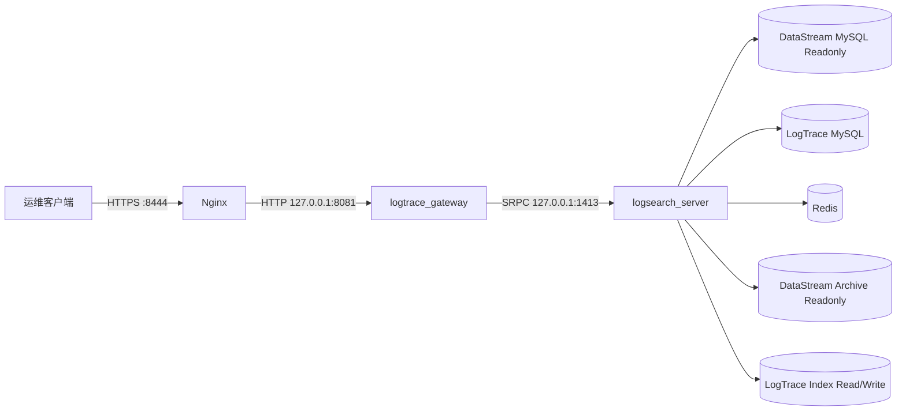

部署资产包括：

- `deploy/nginx/logtrace.conf`；
- `deploy/systemd/smt-logsearch.service`；
- `deploy/systemd/smt-logtrace-gateway.service`；
- `deploy/logrotate/smt-logtrace`。

Search Server 账户只读一期归档，只写二期索引和自身日志。

## 35. 备份与恢复

二期备份内容：

- `smt_logtrace` 状态数据库 mysqldump；
- `index_root` tar；
- 两者 SHA-256 清单。

一期原始归档由 DataStream 备份流程负责，Redis 查询缓存不备份。

恢复顺序：

1. 停止 Gateway；
2. 停止 Search Server；
3. 校验备份 SHA-256；
4. 恢复索引目录；
5. 导入状态数据库；
6. 启动 Search Server，验证全部 READY Segment；
7. 启动 Gateway；
8. 执行固定查询和详情回读。

## 36. 升级与回滚

升级前记录当前二进制、配置、迁移版本并完成备份。先升级 Search Server，验证健康和查询，再升级
Gateway。未执行不可逆迁移时可恢复旧二进制；已经执行迁移后必须按对应版本的数据方案回滚，禁止
手工修改 `schema_migration`。

索引格式不兼容时应显式重建，不允许混用不同格式的 Segment。

## 37. 当前系统边界

- 单 Search Server、单本地索引目录；
- 不支持多实例共享写入同一索引；
- 没有跨机房复制；
- 没有 Segment 自动合并；
- 没有模糊查询、通配符和 OR 查询；
- 没有 RBAC；
- 没有使用 Elasticsearch、Kafka 或 Kubernetes；
- Redis 只用于查询缓存，不是正确性来源；
- 性能数字来自本机仿真。

如果规模继续扩大，可根据真实指标评估 Segment 合并、mmap 按需加载、只读副本、索引分片或迁移到
Elasticsearch/OpenSearch，但这些不属于当前实现。

## 38. 关键设计总结

项目的核心不是单独某个算法，而是把以下事实组合成一条可恢复、可验证的检索链路：

1. 一期提供经过校验的不可变归档；
2. 二期按 archive_id 稳定增量消费；
3. 单文件完整解析后才进入 PARSED 工件；
4. Segment 经过 fsync、摘要校验和 rename 后才登记 READY；
5. 查询只读取不可变 READY 快照；
6. 多关键词使用低 DF 优先 AND；
7. BM25、业务权重和 Top-K 提供稳定排序；
8. doc_id、offset、length 把搜索摘要连接回原始归档；
9. SLRU 和 Redis 只优化性能，不改变数据正确性；
10. 损坏和依赖故障明确暴露，不以不完整结果继续服务。

这套设计使项目既覆盖了简历中的 C++、Linux、网络、数据库、缓存和检索算法，也保持了符合 SMT
运维排障场景的业务边界。
