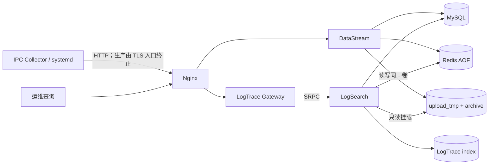

# SMT 双项目 Docker 与单实例可靠性实际改进方案

编写日期：2026-07-15  
适用项目：`01_SMT_DataStream`、`02_SMT_LogTrace`  
依据文档：`SMT双项目生产化改进方案.md`  
文档性质：本轮已实施内容、试点恢复目标与后续生产门槛；不把单机 Docker 描述为高可用。

## 1. 本轮业务判断

当前系统面向三条 SMT 产线的首期试点，Collector 已在 IPC 上使用本地 spool，应对服务短时中断；
DataStream 的正式归档和 MySQL 元数据是质量追溯事实，LogTrace 索引则可从一期事实重建。因此本轮
没有直接引入 active-active、共享文件系统、对象存储、Consul 或 Kubernetes，而是先解决两个现实问题：

1. 开发、联调和预发布的 Workflow、Wfrest、SRPC、Protobuf 与系统库版本不一致；
2. 单实例虽然已有各项目独立备份脚本，但缺少跨项目一致恢复点、受保护恢复入口和定期数据对账。

Collector 暂不容器化。它需要访问设备目录、厂商软件生成文件和本地 spool，继续使用 systemd 更符合
当前 IPC 现场边界。服务端维护时先关闭 Nginx，Collector 请求失败后保留任务并按已有封顶退避恢复。

## 2. 已落地的 Docker 改进

### 2.1 统一构建与运行边界

新增 `deploy-docker/`，主要资产如下：

```text
deploy-docker/
├── compose.yaml               # 完整单机联调栈
├── compose.dev.yaml           # 可选开放 MySQL/Redis 回环端口
├── datastream/Dockerfile      # DataStream 多阶段构建
├── logtrace/Dockerfile        # LogTrace 多阶段构建
├── config/                    # 容器专用严格 JSON 配置
├── nginx/nginx.conf           # 双端口内部反向代理
├── redis/                     # AOF/noeviction 和 Secret 启动入口
├── ops/                       # 迁移、备份、恢复与对账镜像
├── scripts/                   # 宿主机运维入口
└── secrets/example/           # 仅供隔离联调的示例值
```

镜像仍使用项目规定的 C++11。Workflow 固定到提交
`6bd5f0157304cae04da8a6bb2574041a4ff37d15`，Wfrest 固定到
`16aee9067b8a8c92c5057d3b9bc3b14222782e6a`，LogTrace 额外固定 Protobuf `3.20.1` 和
SRPC `0.10.2`。构建阶段包含编译器和头文件，运行阶段只复制业务二进制及必要动态库。

### 2.2 容器拓扑与权限



实际约束：

- DataStream 使用 UID `10001` 和共享归档 GID `10000`；
- LogTrace 使用 UID `10002`，仅通过补充组读取一期归档；Compose 对该卷强制 `:ro`；
- 两个应用镜像均为非 root、只读根文件系统、`cap_drop: ALL`、`no-new-privileges`；
- 只有数据、索引和日志卷可写，`/tmp` 使用受限 tmpfs；
- CPU、内存、进程数和文件描述符存在显式边界；
- Secret 以只读文件挂载，入口脚本只在进程内导出项目已有环境变量，不写入镜像或 JSON；
- 未提供 Secret 时进程明确拒绝启动；仓库示例 Secret 只能用于本机隔离联调；
- Nginx 同时连接内部 `backend` 网络和独立 `edge` 网络，只有其端口绑定宿主机 `127.0.0.1`；
  MySQL/Redis 只连接 `backend`，默认不对宿主机开放。

DataStream 的 `/data/upload_tmp` 与 `/data/archive` 位于同一个 `datastream_data` 卷，保留现有启动
设备号检查和同文件系统原子 `rename`。LogTrace 读取 `/source/archive`，无法修改一期临时区或归档。

### 2.3 基础设施持久化

MySQL 固定为单实例 8.0 系列并开启：

- ROW binlog，保留 7 天；
- `sync_binlog=1`；
- `innodb_flush_log_at_trx_commit=1`；
- 独立迁移账号、DataStream 业务账号、LogTrace 源库只读账号和状态库读写账号。

Redis 开启 AOF everysec、RDB 辅助快照和 `noeviction`。Redis 仍只保存上传会话、防重放与查询缓存；
它丢失时未完成上传由 Collector 新建会话重传，LogTrace 缓存丢失只影响延迟，不改变查询正确性。

数据库迁移继续复用两个项目的 `scripts/db.sh` 和迁移 SHA-256 检查。Compose 在业务进程启动前显式
运行一次迁移容器，业务服务本身不会自动修改表结构。生产必须设置 `SMT_APPLY_DEV_SEED=0`。

## 3. 已落地的单实例数据保护

### 3.1 跨项目一致备份

新增 `deploy-docker/scripts/backup.sh`，执行顺序为：

1. 停止 Nginx、Gateway、Search、DataStream，阻断新上传和 Segment 发布；
2. 保持 MySQL/Redis 运行，分别导出 `smt_datastream` 和 `smt_logtrace`；
3. 备份正式归档与 LogTrace 索引，不备份未完成 `upload_tmp`；
4. 记录创建时间、发布版本和 MySQL binlog 坐标；
5. 对两个 SQL、两个 tar 和 manifest 生成独立 SHA-256 清单；
6. 立即执行清单、SQL 关键表、tar 路径/文件类型和 manifest 结构校验；tar 中的绝对路径、`..`、
   符号链接、硬链接、设备和 FIFO 均拒绝恢复；
7. 按 DataStream、Search、Gateway、Nginx 顺序恢复服务。

这个维护窗口符合当前 Collector spool 设计。备份不包含 Redis：旧会话不是正式归档事实，查询缓存
可以重建。默认本地 `backups/` 只能用于演练，生产备份目录必须挂载到异机、NAS 或受控备份系统；
把备份留在同一块物理盘不能满足宿主机故障恢复目标。备份目录以 `0700` 创建，异机复制代理必须
通过受控账号或 ACL 获得显式读取权限，不能为了方便复制而改成全员可读。

### 3.2 受保护恢复

`deploy-docker/scripts/restore.sh` 是显式破坏性入口，只有环境变量严格等于
`RESTORE:<backup-id>` 才会执行。恢复流程：

1. 停止全部业务进程并复核备份 SHA-256 与安全路径；
2. 重建两个业务库并导入对应 SQL；
3. 清空未完成临时区，恢复正式归档和索引；
4. 恢复固定 UID/GID 权限；
5. 使用 Redis `SCAN + UNLINK` 只清理两个项目自己的会话/缓存前缀；
6. 启动业务进程；
7. 对全部归档正文、READY manifest 和 Segment 工件执行 SHA-256 校验。

恢复脚本不会自动应用 binlog 做时间点恢复。manifest 已保存 binlog 坐标，正式生产若要求比全量备份
更小的 RPO，需要由 DBA 补齐 binlog 异机归档和 PITR 手册并单独演练。

### 3.3 在线对账

新增两档只读检查：

- `--metadata`：核对 `archive_file` 的路径边界、普通文件、大小，核对所有 READY Segment 名称、
  manifest 数据库摘要、固定四工件集合、普通文件类型和工件大小；适合每日运行；
- `--full`：在上述基础上计算一期正文和二期 Segment 全量 SHA-256；适合每周低峰或恢复验收。

检查发现缺失、符号链接、越界路径、大小或摘要不一致时明确失败，不修改数据库、不生成替代正文、
不把损坏 Segment 继续投入查询。

## 4. 试点恢复目标

以下是基于三条产线、Collector 有本地 spool、单主机部署的初始目标。它们只有在现场恢复演练达标并
由业务负责人批准后才能成为 SLA。

| 故障范围 | DataStream 目标 | LogTrace 目标 | 数据含义 |
|---|---|---|---|
| 单业务进程异常 | RTO ≤ 3 分钟，已确认归档 RPO 0 | RTO ≤ 3 分钟，READY 索引 RPO 0 | Compose 自动拉起；Redis AOF 最多影响约 1 秒会话，Collector 可重传 |
| MySQL/Redis 短时重启 | RTO ≤ 10 分钟 | RTO ≤ 10 分钟 | MySQL 依靠持久卷和强刷盘；Redis 会话/缓存允许重建 |
| 应用版本回滚 | RTO ≤ 30 分钟，RPO 0 | RTO ≤ 30 分钟，RPO 0 | 前提是迁移和索引格式满足书面兼容规则 |
| 单主机或本地数据卷丢失 | 试点 RTO ≤ 4 小时；RPO 等于最近一次成功异机备份间隔 | RTO ≤ 4 小时；索引可恢复或从一期重建 | 建议试点备份间隔不超过 4 小时；未配置异机备份时此目标不成立 |

DataStream 原始文件可能用于客诉或质量审计，生产业务若要求 RPO ≤ 15 分钟或不允许维护窗口，本单机
阶段不满足要求。此时下一步应先建设归档异机复制、MySQL binlog 持续归档和存储快照，再评估
active-passive；不能仅增加第二个 DataStream 写实例。

## 5. 使用步骤

本机联调：

```bash
cd deploy-docker
cp .env.example .env
docker compose up -d --build
scripts/health-check.sh
```

备份、校验和恢复演练：

```bash
scripts/backup.sh 20260715-2200
scripts/verify-backup.sh 20260715-2200
scripts/integrity-check.sh --metadata
scripts/integrity-check.sh --full

export SMT_RESTORE_CONFIRM=RESTORE:20260715-2200
scripts/restore.sh 20260715-2200
```

生产使用前必须复制仓库外 Secret，设置 `SMT_SECRET_DIR`，关闭开发 seed，并在现有 Nginx TLS 配置或
工厂统一入口后部署。不能直接把示例密码、回环 HTTP 入口或本地备份目录用于生产。

## 6. 分步执行与验收门槛

### 步骤 A：环境一致性基线

本轮已生成 Dockerfile、Compose、严格容器配置、Secret 注入和持久卷权限。验收要求：

- 从干净 Docker 环境可完成两项目 Release 镜像构建；
- 迁移容器幂等完成，三个业务进程和 Nginx 健康；
- 应用容器不是 root 且根文件系统只读；
- DataStream 临时区与归档区同卷；LogTrace 的一期卷确实为只读；
- 宿主机未开放 MySQL/Redis 公网端口。

### 步骤 B：数据保护基线

本轮已生成一致备份、备份校验、显式恢复和在线对账工具，并已在本机隔离命名卷完成一轮代表性
业务恢复：Collector 上传一条脱敏 AOI 运行日志，DataStream 形成正式归档，LogTrace 构建 READY
Segment，随后备份、清空并恢复两个数据库和两个业务卷。生产前仍需补充：

- 使用现场批准的脱敏样本重复归档查询、关键词查询和原文详情验收；
- 记录现场数据规模下的停止时间、备份时长、恢复时长和全量校验时长；
- 把备份复制到不同故障域后，再模拟原宿主机完全不可用。

### 步骤 C：生产基础设施补齐

以下内容依赖现场资源，本轮没有虚构为已完成：

- 确认业务批准的最终 RTO/RPO、保留周期和质量冻结策略；
- 配置 RAID/企业盘、UPS、SMART、磁盘水位和 Collector spool 告警；
- 将备份目标迁移到异机或受控备份系统，配置调度、保留和失败告警；
- 建立 MySQL binlog 异机归档与 PITR 演练；
- 注入正式 TLS、数据库/Redis账号和 Token，完成轮换与审计；
- 以真实节拍验证 4 小时备份间隔是否会造成不可接受的维护时间。

只有步骤 C 完成且故障/恢复演练达到批准目标后，才能把本方案称为生产可用的可靠单实例。后续若
RTO/RPO 或吞吐证明单机无法满足，再进入 DataStream active-passive、LogTrace 只读副本和存储
fencing，不提前引入 Consul 或并发写多实例。

## 7. 当前验证记录

截至 2026-07-15，本轮实测结果如下：

| 验证项 | 实测结果 |
|---|---|
| 静态检查 | Compose 基础/开发合并配置、两份 JSON、全部新增 Shell 和 `git diff --check` 通过 |
| 原项目回归 | DataStream 非基础设施测试 `47/47`，LogTrace 非基础设施测试 `42/42` 通过 |
| 冷构建 | `smt-ops:dev`、`smt-datastream:dev`、`smt-logtrace:dev` 全部完成；首次分别约 147 秒、505 秒、754 秒 |
| 构建上下文 | DataStream 约 692 KiB、LogTrace 约 663 KiB，没有发送运行数据和既有构建目录 |
| 完整栈 | MySQL、Redis、DataStream、LogSearch、Gateway、Nginx 均为 healthy；迁移容器多次幂等完成 |
| 运行隔离 | 三个应用均为非 root、只读根文件系统、`cap_drop=ALL`、`no-new-privileges`；LogTrace 具备补充 GID `10000` 且一期卷只读 |
| 存储与端口 | 临时区/归档区设备号同为 `2051`；MySQL/Redis 无宿主机端口，Nginx 仅绑定回环地址 |
| 持久化参数 | MySQL 为 `log_bin=1 / ROW / sync_binlog=1 / innodb_flush_log_at_trx_commit=1`；Redis 为 `appendonly=yes / everysec / noeviction` |
| 跨项目业务链路 | Collector 上传 144 字节脱敏日志，生成 `archive_id=1`；LogTrace 形成 1 个文档和 READY Segment，关键词查询命中 `INSPECTION_NG` |
| 备份安全 | 正常备份清单通过；构造的 `../` 路径和符号链接 tar 均被明确拒绝 |
| 真实内容恢复 | 缺少 `RESTORE:<id>` 时未改状态；确认恢复后全量检查为 `archives=1 / READY_segments=1`，归档、关键词和原文详情查询结果一致 |

本轮恢复演练时入口使用了 `.env` 覆盖的 `18080/18081`，两个端口均只监听 `127.0.0.1`；当前默认
交付端口已调整为 `9090/9091`，容器内部仍保持 `8080/8081`。部署时仍必须先做端口冲突检查。

上述结果证明本轮代码和本机隔离恢复链路可用，但不替代现场不同故障域备份、整机丢失、真实节拍与
大数据量恢复演练。第 4 节 RTO/RPO 仍是待业务批准和现场计时验证的试点目标，不是已达成 SLA。
