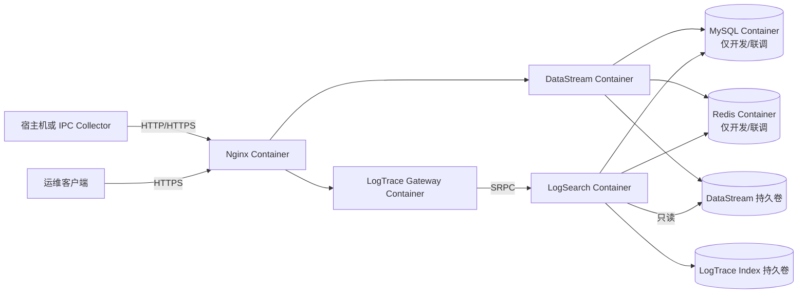
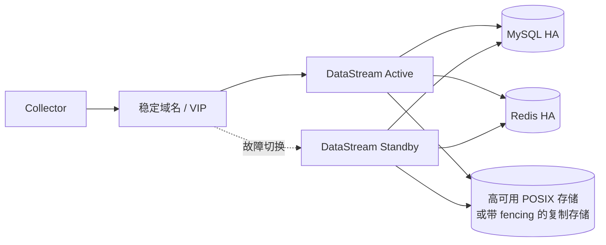
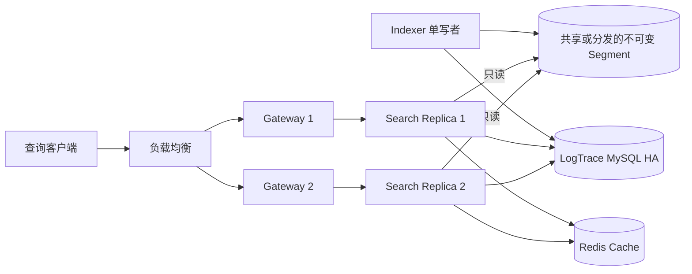
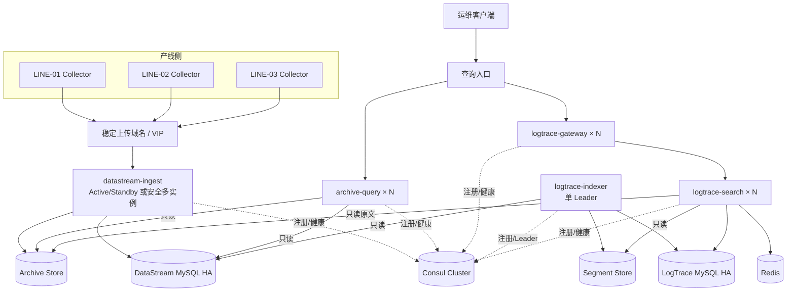

# SMT DataStream 与 LogTrace 生产化改进方案

编写日期：2026-07-14  
适用项目：`01_SMT_DataStream`、`02_SMT_LogTrace`  
文档性质：架构演进建议，不代表下述能力已经实现或通过生产验收。

2026-07-15 已按本文优先级开始落地 Docker 与可靠单实例基线。实际变更、试点 RTO/RPO、使用命令和
尚未完成的现场门槛见 `SMT双项目Docker与单实例可靠性实际改进方案.md`。

## 1. 文档目标与总体判断

当前两个项目已经完成三条 SMT 产线仿真下的主要业务闭环：

```text
设备目录
  -> Collector 封口判定与本地 spool
  -> DataStream 认证、分片上传、完整性校验和正式归档
  -> LogTrace 增量解析、不可变 Segment、BM25/Top-K 检索
  -> Gateway HTTP 查询和原文回读
```

现有方案适合作为单工厂、中小规模、允许短时中断后补传的首期试点。它尚不能直接等同于大型工厂的
生产级高可用平台，主要差距包括：

- 服务、主机和本地归档文件系统存在单点；
- 真实设备格式、文件节拍、MES 主数据和生产查询尚未现场校准；
- 当前只有部署级 Operator Token，缺少用户权限和操作审计；
- 监控、告警、长期容量、正式归档生命周期和恢复演练仍需完善；
- LogTrace 只有单 Search Server、本地索引和单写者索引构建，不支持多副本共享 Segment；
- 当前性能结果来自本机固定仿真，不能作为生产 SLA。

本方案按以下顺序讨论改进：

1. Docker 部署；
2. 改进单实例；
3. 拆分微服务并加入 Consul；
4. 其它必要改进。

需要注意：章节顺序用于组织方案，不表示 Consul 比安全、监控或备份更重要。真实实施前仍必须先明确
设备规模、RTO、RPO、数据保留周期和实际输入格式。

## 2. Docker 部署

### 2.1 必要性与合理性

结论：合理，建议实施；必要性为“中高”。

Docker 能解决的主要问题是构建和运行环境一致性：

- 固定 Workflow、Wfrest、SRPC、OpenSSL 等依赖和运行库版本；
- 让开发、CI、测试和预发布使用相同镜像；
- 一键启动两个项目及 MySQL、Redis、Nginx 的联调环境；
- 明确程序可写目录、只读目录、端口、健康检查和资源限制；
- 降低在新服务器上重复安装依赖的成本；
- 支持按镜像摘要回滚，避免服务器残留旧动态库或旧二进制。

Docker 不能直接解决：

- 单台物理机故障；
- 本地归档磁盘损坏；
- MySQL/Redis 高可用；
- 多实例共享上传会话和正文；
- LogTrace 多副本的 Segment 分发；
- 服务发现和跨节点故障切换。

因此，“容器化完成”不能写成“高可用完成”。单机 Docker Compose 仍然是单点。

### 2.2 推荐容器边界

建议优先容器化服务端，Collector 是否容器化由现场 IPC 环境决定。

| 组件 | 建议 | 原因 |
|---|---|---|
| `datastream_server` | 容器化 | 服务端依赖固定，端口和持久卷边界明确 |
| `logsearch_server` | 容器化 | 需要固定 SRPC/索引依赖，可明确归档只读和索引可写权限 |
| `logtrace_gateway` | 容器化 | 无状态 HTTP 接入层，最适合镜像化和多副本 |
| `logtrace_admin` | 随 Search 镜像提供 | 作为迁移、扫描、构建和重建的受控管理命令，不常驻运行 |
| `collector_agent` | 条件容器化 | 需要访问设备目录、网络共享和本地 spool；部分工控机使用 systemd 更简单可靠 |
| Nginx | 可容器化 | 便于固定 TLS/路由配置；生产证书必须外部注入 |
| MySQL/Redis | 开发环境容器化 | 方便联调；生产是否容器化取决于团队是否具备持久化、备份和 HA 运维能力 |

Collector 运行在产线 IPC 上时，继续使用现有 systemd 部署并不落后。若设备目录来自厂商软件、SMB
挂载或特殊用户组，强行容器化可能增加目录挂载、UID/GID 和网络共享排障成本。

### 2.3 推荐目录

建议在仓库根目录增加统一部署目录：

```text
deploy-docker/
├── compose.yaml
├── compose.dev.yaml
├── .env.example
├── datastream/
│   └── Dockerfile
├── logtrace/
│   └── Dockerfile
├── nginx/
│   ├── nginx.conf
│   └── conf.d/
├── mysql/
│   └── init/
└── scripts/
    ├── migrate.sh
    ├── health-check.sh
    └── acceptance.sh
```

`datastream_server`、`logsearch_server` 和 `logtrace_gateway` 可以使用多阶段构建：构建阶段安装编译器和
头文件，运行阶段只包含二进制、必要动态库、配置和非 root 用户。

### 2.4 Docker Compose 联调架构



### 2.5 持久卷和文件语义

DataStream 完成归档依赖同文件系统内的原子 `rename`。容器部署时，临时目录和正式归档目录不能放在
两个无关的 Docker Volume 中。

推荐使用同一个持久卷：

```text
/var/lib/smt-datastream/
├── upload_tmp/
└── archive/
```

容器内对应：

```text
/data/upload_tmp
/data/archive
```

启动时仍应保留现有设备号检查，确认两个目录位于同一文件系统。

LogTrace 的挂载权限建议为：

| 路径 | Search Server 权限 |
|---|---|
| DataStream `archive_root` | 只读 |
| LogTrace `index_root` | 读写 |
| 配置文件 | 只读 |
| 日志目录 | 可写，或改为标准输出后由容器平台采集 |

### 2.6 安全和运行约束

生产镜像至少满足：

- 使用非 root 用户；
- 根文件系统只读；
- 只给数据和日志目录写权限；
- 不把数据库密码、设备密钥、Operator Token 和 TLS 私钥写入镜像；
- 通过 Secret、只读文件或外部密钥系统注入敏感配置；
- 不在镜像中保留编译器、调试工具和构建缓存；
- 设置 CPU、内存、进程数和文件描述符限制；
- 设置 `stop_grace_period`，确保服务完成优雅退出；
- 健康检查使用真实 `/health/live` 和 `/health/ready`；
- 镜像使用不可变版本和摘要，不复用含义变化的 `latest`；
- 在 CI 中生成 SBOM 并执行基础镜像和依赖漏洞扫描。

### 2.7 实施步骤

1. 为 DataStream 和 LogTrace 编写多阶段 Dockerfile；
2. 使用与当前 CMake 相同的 C++11 编译选项构建镜像；
3. 增加开发用 Compose，启动 MySQL、Redis、Nginx 和三个服务端进程；
4. 在容器启动前显式执行迁移，不让业务服务自动修改表结构；
5. 将 DataStream 临时区和归档区放入同一持久卷；
6. 将 DataStream 归档以只读方式挂载给 LogTrace；
7. 复用现有 54 项、46 项和跨项目 E2E 作为容器验收；
8. 增加容器重启、宿主机重启、卷恢复和镜像回滚测试；
9. 生产环境根据运维能力决定 MySQL/Redis 使用独立部署还是受管服务。

### 2.8 验收标准

- 从干净主机执行一条 Compose 命令可启动完整联调环境；
- 两个项目全量测试和跨项目闭环通过；
- 容器重建后，持久卷中的归档和索引不丢失；
- DataStream 临时区到归档区仍使用原子 `rename`；
- LogTrace 无法写入一期归档目录；
- 未注入 Secret 时服务明确拒绝启动；
- 健康检查能区分进程存活和依赖就绪；
- 镜像回滚后数据库迁移和索引格式兼容规则明确；
- 日志和镜像层中不存在真实密码、Token 或设备密钥。

## 3. 改进单实例

### 3.1 必要性与合理性

结论：对简历和本机演示不是必须；对承担质量追溯的生产系统是最重要的架构改进之一。

当前单实例风险包括：

- DataStream 进程、服务器和归档磁盘任一故障都可能影响上传；
- 本地归档损坏可能造成原始质量证据永久丢失；
- 单 Search Server 故障会使日志查询不可用；
- 本地索引损坏需要停机恢复或重建；
- 单 MySQL/Redis 仍然是基础设施单点；
- Docker 只能重启进程，不能让故障物理机恢复服务。

但当前 Collector 已有本地 spool，服务端短时不可用时设备文件可以暂存。因此生产方案不必直接从
单实例跳到复杂的 active-active，应先根据业务目标选择可靠单机、主备或多活。

### 3.2 改进前必须确认的指标

| 指标 | 需要回答的问题 |
|---|---|
| RTO | DataStream、检索和文件下载分别允许停止多久？ |
| RPO | 允许丢失多少已归档文件、元数据或索引？ |
| 离线窗口 | Collector 本地磁盘能够缓存多少小时或多少天？ |
| 数据等级 | 原始文件是否用于客诉、审计或法规追溯？ |
| 查询可用性 | 上传正常但 LogTrace 暂停是否可接受？ |
| 故障范围 | 是否要求主机、机架或机房故障后继续服务？ |
| 恢复能力 | 索引允许从一期归档重建多久？ |

没有这些输入，无法判断主备、共享存储、对象存储和多活的投入是否合理。

### 3.3 第一阶段：增强单机可靠性

如果工厂允许分钟级恢复，先增强单机通常比直接多活更合理：

- DataStream 和 LogTrace 使用 systemd 或容器自动重启；
- 归档盘使用 RAID、企业级磁盘、UPS、SMART 和磁盘水位告警；
- Redis 开启符合会话需求的持久化和 `noeviction`；
- MySQL 建立全量备份、增量/binlog 恢复和定期恢复演练；
- 归档目录执行异机或离线备份；
- 备份窗口同时覆盖 MySQL 元数据和正式归档；
- 定期核对 `archive_file` 与正文的存在性、大小和 SHA-256；
- 根据最长断网时间配置 Collector spool 容量；
- 准备备用服务器、安装包、配置和书面切换步骤。

这不能消除单点，但可以显著降低数据永久丢失风险，并为后续主备提供可靠基线。

### 3.4 第二阶段：DataStream 主备

DataStream 当前最适合先采用 active-passive，而不是在负载均衡器后直接运行两个写实例。



主备方案的关键不是发现两台服务，而是保证任何时刻只有一个实例可以写正式归档。必须具备：

- Leader 租约或存储 fencing；
- 切换后旧主不能继续写；
- MySQL 唯一约束继续保护 `upload_id` 和正式路径；
- Redis 会话状态在切换后可读取，或明确由 Collector 创建新会话；
- 临时文件位于新主可接管的存储上，或者允许丢弃临时文件后由 spool 重传；
- VIP/DNS 切换时间小于 Collector 可接受的恢复窗口；
- 主备不能同时执行清理任务和归档完成操作；
- 定期执行计划内和非计划故障切换演练。

如果使用共享 POSIX 存储，必须确认：

- 同一挂载点内的 `rename` 原子语义；
- 文件锁和缓存一致性；
- 存储自身不是单点；
- 故障主机被隔离后才允许备用节点接管写权限。

### 3.5 为什么不能直接增加两个 DataStream 实例

当前 Workflow 文件任务队列只保证单实例内，同一个 `upload_id` 的文件操作按要求串行。简单部署
两个实例并在 Nginx 后轮询会产生以下风险：

- 创建会话在实例 A，分片被路由到实例 B；
- 两个实例同时 `pwrite` 同一个临时文件；
- complete 在两个实例并发执行；
- 一个实例 `rename` 后，另一个实例仍使用旧临时路径；
- Redis 状态和实际文件写入顺序不一致；
- 节点失效后本地临时文件无法被另一节点访问。

会话亲和只能减少跨节点请求，不能解决节点失效后的临时正文接管，也不能代替完成阶段的 fencing。

### 3.6 DataStream active-active 的长期方案

只有业务明确要求跨节点连续写入时，再选择以下方向之一。

#### 方案 A：共享 POSIX 存储

- 临时文件和正式归档位于所有实例可访问的同一共享文件系统；
- Redis 或数据库保存带 fencing token 的上传所有权；
- 每个文件操作验证当前 token；
- complete 使用分布式租约加 MySQL 唯一约束；
- 清理任务也需要单 Leader 或安全分区扫描。

优点是能够保留 `pwrite`、`mmap`、`rename` 和 `pread` 设计；缺点是共享文件系统和锁语义成为新的
复杂基础设施。

#### 方案 B：对象存储 multipart upload

- Collector 或 DataStream 使用对象存储的分片上传能力；
- object key 代替本地临时路径；
- multipart complete 代替文件系统 `rename`；
- LogTrace 详情使用 Range GET 代替 `pread`；
- archive 元数据增加对象版本、ETag 和存储层校验字段。

该方案更适合跨节点和异地复制，但会改变当前最核心的文件完成和原文回读语义，属于架构 v2，不能
当作部署配置修改处理。

### 3.7 LogTrace 多实例

LogTrace 的查询链比 DataStream 更容易扩展，因为 READY Segment 和查询快照是只读的。

建议目标：



推荐演进顺序：

1. Gateway 先变为多副本；
2. 保持一个 Search Server，增加冷备和自动拉起；
3. 将索引构建从 Search Server 拆为单独 Indexer；
4. 将 READY Segment 发布到所有 Search 可读取的位置；
5. Search Server 只读加载完整且校验通过的 Segment；
6. 增加多个 Search 副本并执行负载均衡；
7. 新 Segment 发布后，各副本独立校验并原子交换本地快照；
8. 某个副本加载失败时从负载均衡中摘除，不能返回部分索引结果。

索引构建必须保持一个有效写者。可使用 MySQL 租约、带 fencing token 的 Leader 记录，或者在后续
引入 Consul 后使用 Session/Lock；仅有互斥锁但没有 fencing 仍可能在网络分区后产生旧 Leader 写入。

### 3.8 单实例改进验收标准

- 明确并批准 DataStream、LogTrace、MySQL、Redis 和归档存储的 RTO/RPO；
- 主节点强退后，备用节点在目标时间内接管；
- 故障期间 Collector spool 不丢任务、不超过容量；
- 切换前后同一 `upload_id` 最多生成一条归档记录和一个正式文件；
- 存储发生网络分区时不会出现两个写主；
- MySQL 和归档目录能恢复到一致业务点；
- Search 副本只加载完整 READY Segment；
- 任一 Search 副本损坏不会污染其他副本；
- Redis 缓存丢失不改变查询正确性；
- 定期故障切换和恢复演练形成可审计报告。

## 4. 拆分微服务并加入 Consul

### 4.1 必要性与合理性

结论：当前不是必要改进；在多主机、多副本和独立扩缩容出现后合理。必要性为“低到中，条件触发”。

当前实际进程边界已经包括：

- 每台 IPC 的 `collector_agent`；
- `datastream_server`；
- `logtrace_gateway`；
- `logsearch_server`；
- 管理命令 `logtrace_admin`。

这不是一个完全没有拆分的单体系统。继续拆分必须解决独立部署、独立扩容或故障隔离问题，不能仅以
“类和目录很多”为理由。

Consul 可以解决：

- 多主机环境中的服务注册；
- 健康实例发现；
- DNS 或 HTTP Catalog 查询；
- 部分服务的 Leader Session/Lock；
- 裸机/虚拟机场景下的动态地址管理。

Consul不能解决：

- DataStream 临时正文共享；
- `pwrite`、Bitmap 和 complete 的跨实例一致性；
- 正式归档存储高可用；
- MySQL/Redis 数据复制；
- Segment 分发和版本一致性；
- API 幂等、超时、重试和熔断；
- 网络分区后的旧 Leader fencing。

因此，必须先解决存储和单写者问题，再让注册中心发现多个真正可用的实例。

### 4.2 触发微服务拆分的条件

满足一项或多项后再拆分更合理：

- 上传和归档查询的容量差异明显，需要独立扩容；
- LogTrace 索引构建导致查询 p95/p99 明显升高；
- Gateway、Search 和 Indexer 需要不同硬件规格；
- 多个 Search 副本需要动态上下线；
- 不同团队分别维护采集归档、索引构建和查询接口；
- 发布频率不同，单进程升级影响了不相关业务；
- 服务部署到多台主机，固定 IP/端口管理开始产生实际故障；
- 经过容量测试确认模块边界，而不是仅凭技术偏好拆分。

### 4.3 推荐拆分边界

不建议把 DataStream 拆成认证、Redis、分片、文件写和归档五个细服务。这些步骤共享同一个上传状态和
文件一致性边界，拆开会形成大量同步 RPC 和补偿逻辑。

建议采用较粗粒度、能够独立扩容的边界。

| 服务 | 职责 | 数据权限 |
|---|---|---|
| `datastream-ingest` | 心跳、设备认证、防重放、会话、分片、完成校验、原子归档 | 写上传 Redis、写归档文件、写 `archive_file` |
| `archive-query` | 归档列表、详情和后续受控下载 | 只读 `archive_file` 和必要主数据；正文只读 |
| `logtrace-gateway` | HTTP、用户认证、参数校验和 RPC 错误映射 | 不直接访问索引 |
| `logtrace-indexer` | 增量消费、解析、Segment 构建和发布 | 一期只读；二期状态和索引写入；保持单 Leader |
| `logtrace-search` | 加载 READY Segment、检索、缓存和详情回读 | Segment/归档只读；Redis 查询缓存读写 |

`archive-query` 只有在 Operator 查询流量明显影响上传、需要独立权限或需要独立扩容时才拆。当前规模下
可以继续保留在 DataStream 内。

### 4.4 目标微服务架构



### 4.5 Consul 部署原则

生产 Consul 应使用独立奇数节点集群，通常为 3 个或 5 个 Server，业务节点运行 Agent 或使用受控的
注册方式。不能只运行一个 Consul Server，否则注册中心自身又成为单点。

建议用途：

- 注册 `archive-query`、Gateway、Indexer 和 Search 实例；
- 注册健康检查和服务元数据；
- Gateway 发现健康 Search 实例；
- 查询入口或代理发现健康 Gateway/Archive Query；
- Indexer 使用 Consul Session 竞争 Leader，但发布操作仍验证 fencing token；
- 记录机房、版本、协议和只读/写者角色等标签。

不建议用途：

- 不把设备密钥、数据库密码和 Token 当作普通 KV 存入 Consul；
- 不让产线设备或 Collector 直接访问 Consul 集群；
- 不用 Consul KV 替代 MySQL 业务事实；
- 不用注册成功代替应用 readiness；
- 不在每个请求中同步查询 Consul；
- 不因为 Consul 暂时不可用就中断已有健康连接；
- 不用普通分布式锁代替存储 fencing。

Collector 应继续访问稳定上传域名或 VIP，而不是获得所有 DataStream 实例列表。这样可以隔离工厂网络和
内部服务拓扑，也便于在入口统一执行 TLS、请求限制和故障切换。

### 4.6 服务发现和调用策略

推荐调用流程：

1. 服务启动后注册实例 ID、地址、端口、版本和健康检查；
2. 健康检查使用 `/health/ready` 或专用 RPC readiness；
3. 调用方通过本地 Agent DNS、缓存 Catalog 或代理获取健康实例；
4. 调用方缓存实例列表，不为每次业务请求访问 Consul；
5. 连接失败时只对明确幂等的只读调用选择其他实例；
6. 上传、complete 和索引发布不能因为换实例就盲目重试；
7. 实例退出时先从服务发现摘除，再停止接收新请求，最后完成优雅退出；
8. 旧版本和新版本并存时，RPC/HTTP 契约必须保持兼容或通过版本化服务名隔离。

如果以后使用 Kubernetes，优先评估 Kubernetes Service、DNS、Lease 和 StatefulSet 是否已经满足需求。
在没有跨平台服务网格或多数据中心 Consul 需求时，不必同时维护 Kubernetes 和 Consul 两套发现机制。

### 4.7 微服务拆分后的数据一致性

服务拆分后仍必须保持“单一数据所有者”：

- `datastream-ingest` 是上传会话和正式归档的唯一写者；
- `archive-query` 只读，不修复或修改一期归档；
- `logtrace-indexer` 是 Segment 的唯一发布者；
- `logtrace-search` 只加载 READY Segment，不写索引；
- Redis 查询缓存不是正确性来源；
- 一期 `archive_file` 和归档正文仍是 LogTrace 重建来源。

若后续需要低延迟通知 LogTrace，不建议直接在 DataStream 中同步调用 Indexer。可以继续按
`archive_id` 轮询；只有延迟或源库压力确实成为问题后，再考虑：

- 在 DataStream MySQL 事务中写 Outbox；
- 独立发布器读取 Outbox；
- LogTrace 幂等消费归档事件；
- 仍以一期 MySQL 和正式文件校验作为最终事实。

消息队列只负责减少发现延迟，不能替代源数据扫描和恢复校验。

### 4.8 微服务与 Consul 验收标准

- 任一实例注册、摘除和健康变化能在目标时间内被调用方感知；
- Consul 短暂不可用时，已有服务连接和本地缓存发现结果仍可继续工作；
- 不健康实例不会继续接收新流量；
- Gateway 多副本查询结果一致；
- Indexer 同一时刻只有一个有效发布者；
- 网络分区后的旧 Indexer 无法覆盖新 Leader 发布的 Segment；
- DataStream 拆分后，上传和归档的唯一写者边界没有被破坏；
- 只读服务账号无法修改一期数据库和归档；
- 滚动升级期间 API/RPC 契约兼容；
- 故障注入覆盖 Consul Server 丢失、Agent 丢失、网络分区和实例强退；
- 注册中心异常不会造成静默成功、重复归档或部分索引结果。

## 5. 其它必要改进

### 5.1 必要性与总体优先级

以下改进中，真实设备校准、SLO、监控、安全和数据保护通常比微服务与 Consul 更必要。建议按 P0、P1、
P2 管理，而不是一次性把所有技术加入系统。

### 5.2 P0：真实生产接入前必须完成

#### 5.2.1 真实设备和文件格式校准

- 获取 SPI、AOI、FCT 不同型号和软件版本的脱敏样本；
- 核对真实目录、命名、编码、轮转和封口行为；
- 验证 GBK、UTF-8、多行日志、非标准 CSV 和厂商二进制格式；
- 明确 sidecar 由厂商、IPC 适配器还是 Collector 生成；
- 建立设备版本到 Collector 规则、Parser Profile 的明确映射；
- 文件格式变化时保留原始归档并明确隔离，不能自动猜测后继续索引。

#### 5.2.2 产能和 SLO 基线

- 每条线每小时板数；
- 每块板的文件数和大小分布；
- NG 图片、ZIP、FCT 报告和运行日志的平均值、p95 和最大值；
- 同一秒和换班时的突发倍率；
- 最长断网时间和恢复回灌速度；
- 日增量、保留周期和索引文档增长速度；
- 上传、归档和查询的 p95/p99 目标；
- DataStream、LogTrace、MySQL、Redis 和存储的 RTO/RPO。

#### 5.2.3 MES 和主数据边界

- 明确产线、工位、设备、工单、产品 SN 和配方的权威来源；
- 决定哪些字段只做格式校验，哪些必须与 MES 核对；
- 明确 MES 不可用时拒绝上传、延迟校验还是先保存原始数据；
- 对 MES 查询使用幂等缓存或异步校验，避免同步依赖拖垮上传；
- 保存生产关系快照，避免主数据后续变化破坏历史追溯。

#### 5.2.4 安全、身份和审计

- 使用生产 TLS 证书和受控内网边界；
- 建立设备密钥初始化、轮换、吊销和泄露处置；
- 多人使用前引入用户身份、RBAC 和 Token 生命周期；
- 至少区分设备写入、归档查询、日志查询、索引重建和系统管理权限；
- DataStream、LogTrace、迁移和备份分别使用最小权限数据库账号；
- 记录登录、查询、下载、重建、删除、配置和权限变更审计；
- 敏感日志继续禁止输出密码、密钥、签名、Token 和完整原文。

#### 5.2.5 监控与告警

DataStream 指标：

- 在线设备数和心跳延迟；
- Collector spool 数量、字节数、最老任务年龄；
- 活跃会话、保留字节、分片吞吐和重试次数；
- HMAC、重放、缺片、冲突、摘要失败和归档失败计数；
- MySQL/Redis 请求延迟和错误率；
- 临时目录和正式归档的使用率、增长率和预计耗尽时间。

LogTrace 指标：

- 源归档到索引 READY 的延迟；
- PENDING、PARSED、FAILED、BUILDING、READY 数量；
- Segment 数量、文档数、加载和发布耗时；
- 查询吞吐、p50/p95/p99、候选文档数和 Top-K 耗时；
- Redis 命中率、本地 SLRU 命中率；
- 原文 `pread`/Range Read 延迟和失败；
- 快照版本、快照切换耗时和峰值 RSS。

需要配置磁盘水位、spool 积压、连续心跳丢失、基础设施错误、索引持续失败和查询 p99 超标告警。

#### 5.2.6 数据保护和生命周期

- 定义不同文件类型的保留周期；
- 明确热存储、冷存储和离线备份层次；
- 正式归档删除需要审批、审计和可恢复窗口；
- 客诉、审计或质量冻结数据不得被普通生命周期任务删除；
- 定期对账 MySQL 元数据和归档正文；
- 定期进行 SHA-256 抽样或全量校验；
- 备份必须包含一致的 MySQL、归档和 LogTrace 状态/索引；
- Redis 查询缓存不需要备份，上传会话持久化策略必须符合恢复目标；
- 定期从备份恢复到隔离环境并执行固定查询。

### 5.3 P1：稳定运行和规模增长前完成

#### 5.3.1 LogTrace Segment 生命周期

当前不可变 Segment 会持续增加。长期运行需要：

- 记录 Segment 数量、大小和查询放大；
- 按时间或规模触发离线合并；
- 合并先构建新 Segment，完整校验后原子切换；
- 新快照发布前保留旧 Segment；
- 所有旧查询释放快照后再删除旧文件；
- 合并失败不影响旧快照；
- 支持按一期归档重新构建完整索引；
- 测试新旧快照并存时的内存峰值。

#### 5.3.2 限流、背压和容量保护

- Nginx 按设备、接口和来源配置合理限流；
- DataStream 继续执行全局、设备和 Collector 会话配额；
- 磁盘压力时拒绝新会话，不中断接近完成的合法会话；
- Collector 只对网络错误、超时和明确可重试 5xx 执行封顶退避；
- MySQL/Redis 连接和 Workflow 任务数按压力测试校准；
- LogTrace 限制关键词数、时间范围、结果窗口和详情大小；
- 过载时明确返回 429/503，不能伪造成功或无限排队。

#### 5.3.3 文件取回闭环

当前 DataStream 主要完成文件定位。真实运维可能需要查看 NG 图片、检测结果和完整报告。可选择：

- 受控只读共享目录；
- 带权限和审计的下载接口；
- 对象存储短期签名 URL。

如果增加下载接口，需要重新评审：

- RBAC；
- 路径穿越和符号链接；
- HTTP Range；
- 大文件限速和并发；
- 下载审计；
- 文件保留和冻结状态；
- 不能把 `relative_path` 直接暴露为公开 URL。

#### 5.3.4 CI/CD 和发布治理

- 每次提交执行 Debug 构建、单元测试和静态检查；
- 合并前执行 MySQL/Redis 集成测试和跨项目 E2E；
- 发布候选执行 Release、Sanitizer、Valgrind 和固定负载；
- 镜像和二进制生成 SHA-256、SBOM 和版本说明；
- 数据库迁移在业务进程启动前显式执行；
- 索引格式、Protobuf 和 HTTP API 采用明确版本策略；
- 先预发布、再灰度、最后正式发布；
- 回滚步骤同时考虑二进制、数据库迁移、配置和索引格式。

### 5.4 P2：业务规模触发后评估

- Outbox/CDC 或消息队列降低 LogTrace 新归档发现延迟；
- 对象存储和跨区域复制；
- DataStream active-active；
- 多工厂租户隔离和区域化部署；
- LogTrace 索引分片和只读副本；
- Elasticsearch/OpenSearch 替代或补充自研倒排索引；
- Kubernetes 和自动扩缩容；
- 多机房容灾和演练；
- 统一身份平台、企业审计和密钥管理系统。

这些能力只有在现有方案经指标证明无法满足要求时才引入。

## 6. 推荐实施路线

### 阶段 0：生产输入确认

- 收集真实脱敏样本；
- 明确设备数量、节拍、文件大小和保留周期；
- 确认 MES、身份、RTO、RPO 和查询 SLA；
- 建立可复现容量模型。

完成门槛：关键架构参数不再只依赖仿真假设。

### 阶段 1：Docker 化和环境一致性

- 完成服务端 Dockerfile 和开发 Compose；
- 保持 Collector 可按现场条件使用 systemd；
- 接入 CI 镜像构建、全量测试和跨项目 E2E；
- 验证卷、Secret、健康检查和镜像回滚。

完成门槛：干净环境可以一键启动并通过全部验收。

### 阶段 2：可靠单机和主备

- 完成监控、告警、备份恢复、生命周期和权限基线；
- 建设 DataStream active-passive；
- 为 MySQL、Redis 和归档存储配置符合 RTO/RPO 的方案；
- Gateway 多副本，Search Server 先冷备再只读多副本；
- 完成故障切换和数据一致性演练。

完成门槛：单主机故障不造成正式归档丢失，并能在目标 RTO 内恢复。

### 阶段 3：按指标拆分微服务

- 查询流量影响上传后拆 `archive-query`；
- 索引影响检索后拆 `logtrace-indexer`；
- 建立共享/分发的不可变 Segment；
- 增加 Search 多副本；
- 仅在多主机动态发现需求明确后部署 Consul 集群；
- 完成服务发现、Leader fencing、滚动升级和网络分区测试。

完成门槛：拆分后的独立扩容收益有压力数据证明，且没有破坏原有正确性。

### 阶段 4：规模化能力

- 根据真实瓶颈选择对象存储、事件通知、索引合并、索引分片或搜索平台；
- 建设多工厂、多区域和跨机房容灾；
- 持续执行容量、长稳、故障和恢复测试。

完成门槛：新复杂度对应明确业务收益，并具备人员、监控和运维能力。

## 7. 决策总结

| 改进项 | 当前必要性 | 合理方案 | 不建议做法 |
|---|---|---|---|
| Docker 部署 | 中高 | 先容器化服务器端和联调环境，Collector 按现场选择；严格设计持久卷、Secret 和健康检查 | 把单机 Compose 宣称为高可用；把真实密钥写进镜像 |
| 改进单实例 | 生产环境高 | 先可靠单机和备份，再 DataStream 主备、Gateway 多副本、Search 只读副本 | 直接把两个 DataStream 放到负载均衡器后并发写本地临时文件 |
| 微服务拆分 | 当前低，条件触发 | 保留粗粒度一致性边界；优先拆 Archive Query、LogTrace Indexer 和只读 Search | 把 HMAC、分片、Redis、文件写和归档拆成大量同步小服务 |
| Consul | 当前低，多主机后中 | 用于健康服务发现和受 fencing 保护的 Leader 选举；Collector 仍访问稳定域名 | 用 Consul 代替存储 HA、业务数据库、Secret 管理或请求幂等 |
| 监控、安全、真实样本 | 高 | 生产接入前完成并持续校准 | 等微服务完成后才考虑业务输入和运维 |
| 对象存储/Kafka/Kubernetes | 条件触发 | 根据跨节点、低延迟和规模指标选择 | 为展示技术栈提前加入 |

最终建议是：先用 Docker 提升环境一致性，再围绕数据安全和恢复目标改进单实例；只有出现多主机、
独立扩缩容和动态实例管理需求后，才按明确边界拆微服务并加入 Consul。同时把真实设备校准、监控、
安全、备份和数据生命周期作为贯穿所有阶段的生产必需项。
