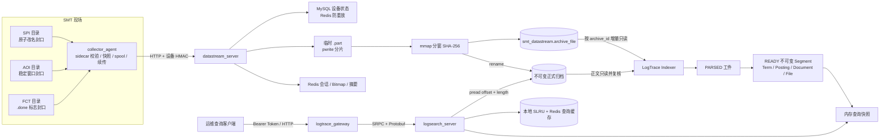
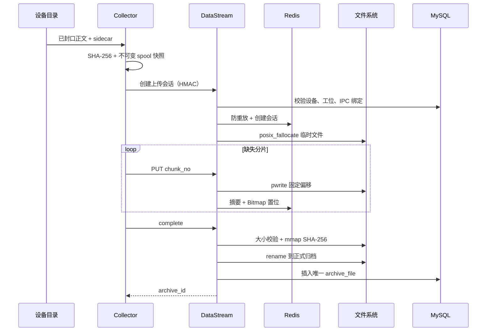

# SMT DataStream 与 LogTrace 联调及压力测试报告

测试日期：2026-07-14（Asia/Shanghai）  
代码基线：Git `3a3a9b8`  
测试结论：两个项目的独立回归、真实跨项目闭环和本机固定压力场景均已执行。功能测试共
`100/100` 项通过；Collector → DataStream → LogTrace → HTTP 查询闭环通过。固定可控负载下无失败，
无节流心跳达到约 `187.20 RPS` 时出现 `8/1000` 个 HTTP 503，表明当前本机单实例的心跳写链路已接近
MySQL/Workflow 接入边界。

> 本报告中的吞吐与延迟只代表本机、当前配置和固定测试数据，不是生产 SLA，也不能直接换算为工厂
> 设备容量。

## 1. 两个项目分别做什么

| 项目 | 职责 | 不负责 |
|---|---|---|
| `01_SMT_DataStream` | 从 SPI、AOI、FCT 设备目录采集文件，完成设备 HMAC 认证、防重放、心跳、不可变 spool、分片/乱序上传、断点续传、完整性校验、原子归档和元数据入库 | 不解析日志内容，不构建倒排索引，不做全文检索和 BM25 排序 |
| `02_SMT_LogTrace` | 只读消费 DataStream 已归档的 `RUNTIME_LOG` 和 `TEST_REPORT`，再次核对大小与 SHA-256，解析为记录，构建不可变倒排 Segment，执行结构化过滤、关键词 AND、BM25、业务权重和 Top-K，并提供故障检索及原文详情 | 不接收设备上传，不实现设备认证，不修改一期 `archive_file` 和归档正文，不索引图片或导出包 |

简单理解：

- DataStream 解决“设备文件能否经过认证，安全、完整、可恢复地保存下来”。
- LogTrace 解决“保存下来的日志如何形成索引，并被快速、准确地查出来”。

两个项目不是互相调用的双向关系。DataStream 是归档事实的生产者；LogTrace 是一期 MySQL 元数据和
归档文件的只读消费者。两者以 `archive_id`、`relative_path`、文件大小和 SHA-256 作为衔接契约。

## 2. 完整数据流转



### 2.1 从设备目录到正式归档

1. SPI、AOI、FCT 分别以原子改名、连续稳定窗口、同名 `.done` 文件表明正文已经封口。
2. Collector 校验 sidecar 元数据，将封口文件复制为不可变 spool 快照，并用原子状态文件保存任务；
   后续上传读取快照，不继续读取可能变化的设备原文件。
3. Collector 计算整文件 SHA-256，以设备身份生成 HMAC。签名覆盖方法、路径、设备号、时间戳、
   请求 ID 和请求体摘要；服务端同时检查时间窗口和 Redis 防重放键。
4. DataStream 从 MySQL 验证设备、工位和 IPC 绑定，检查文件类型、大小、磁盘水位与会话配额，
   使用 `posix_fallocate` 创建临时文件，并在 Redis 建立有 TTL 的上传会话。
5. Collector 查询缺失分片并上传。服务端按 `chunk_no * chunk_size` 使用 `pwrite` 写入；只有写入成功
   后才在 Redis Bitmap 置位。相同分片和摘要可幂等重传，不同摘要返回冲突。
6. 全部分片完成后，会话从 `UPLOADING` 冻结到 `VERIFYING`。DataStream 校验文件大小，并通过分窗
   `mmap` 计算整文件 SHA-256。
7. 校验通过后，临时文件在同一文件系统内通过 `rename` 原子进入正式归档，再写入
   `smt_datastream.archive_file`。确定性路径和 MySQL 唯一约束保证完成请求重试不会产生重复归档。



### 2.2 从归档到可查询索引

1. LogTrace 按单调递增的 `archive_id` 扫描一期 `archive_file`，只选择 `RUNTIME_LOG` 和
   `TEST_REPORT`；图片、检测 JSON、设备导出包仍只由一期保存。
2. 索引器安全组合 `archive_root + relative_path`，检查普通文件、大小和 SHA-256，再按
   `device_id + file_type` 选择明确的解析器，不自动猜测未知格式。
3. `kv_runtime_v1` 将一条物理日志行解析为一个文档；`fct_csv_v1` 将一个测试点解析为一个文档。
   每个文档记录 `archive_id + byte_offset + byte_length`，不复制完整原文。
4. 一批文件完整解析后先原子发布 `PARSED` 工件；坏文件记录稳定失败码，不把半个文件的文档发布。
5. Segment 构建器生成 `terms.bin`、`postings.bin`、`documents.bin` 和 `files.bin`，完成摘要校验、
   `fsync` 与目录 `rename` 后，再把 MySQL 批次更新为 `READY`。
6. Search Server 只加载数据库登记且 manifest 完整的 READY Segment，并一次性替换不可变查询快照。

### 2.3 从查询请求到原文返回

1. 客户端携带 Operator Bearer Token 请求 Gateway；Gateway 校验 JSON、过滤条件、时间范围和分页。
2. Gateway 通过 Protobuf/SRPC 调用 Search Server，网络错误、超时和业务错误映射为不同 HTTP 状态。
3. Search Server 先检查带 `snapshot_version` 的 Redis 查询页缓存；未命中时读取当前不可变快照。
4. 多关键词使用 AND 语义，先处理低文档频率词的 Posting，再做结构化过滤。
5. 候选文档使用 BM25 加错误码、模块和日志等级权重评分，以 Top-K 小顶堆保留当前页面所需结果。
6. 详情查询根据 Segment 中的 offset/length 使用 `pread` 从一期归档回读精确原始字节。本地 SLRU
   缓存热点详情；Redis 不保存日志正文。

## 3. 测试环境与隔离方式

| 项目 | 本次实际环境 |
|---|---|
| 操作系统 | Linux 5.15.0-43-generic，x86_64，VMware 虚拟机 |
| CPU | Intel Core Ultra 9 275HX，测试环境可见 8 个逻辑 CPU |
| 内存 | 7.7 GiB，测试结束复核时可用约 5.3 GiB |
| 编译器 / 构建 | GCC 11.4.0，CMake 3.22.1，C++11 |
| MySQL / Redis | MySQL 8.0.45，Redis 6.0.16，均为本机回环地址 |
| Python | 3.10.12，仅用于 E2E 编排和固定负载客户端 |

隔离措施：

- 跨项目 E2E 每次创建随机后缀的临时源数据库、状态数据库、归档目录、索引目录和 Redis 前缀；
  `finally` 阶段停止四个进程并删除临时数据库。
- DataStream 压测没有使用已占用的系统部署端口 8080，而是在 18080 启动独立实例，使用
  `smt:test:load:20260714:` Redis 前缀和 `/tmp` 临时上传/归档目录。
- 压测结束后测试实例已停止，专用 Redis 前缀剩余键数为 0；未停止或修改 8080 上的部署实例。
- 密码、设备密钥和 Token 只从仓库忽略的环境文件加载，测试输出和本报告均不记录实际值。

## 4. 功能与异常测试结果

### 4.1 DataStream 全量测试

执行命令：

```bash
set -a
source 01_SMT_DataStream/conf/datastream.env
set +a
ctest --test-dir 01_SMT_DataStream/build --output-on-failure
```

结果：`54/54` 通过，0 失败，实际耗时 `14.69 s`；其中 7 项带 `integration` 标签。

| 测试层次 | 本次验证重点 |
|---|---|
| 单元/契约 | 严格配置、弱 Token/未知字段拒绝、时间与 UUID、HMAC/SHA-256、游标、上传模型、路径穿越、spool 原子状态、归档摘要和清理边界 |
| 真实客户端集成 | MySQL/Redis 正常连接及无效端点明确失败 |
| 心跳 E2E | HMAC、时间窗口、防重放、设备/IPC 绑定和状态写入 |
| 上传 E2E | 多会话、乱序分片、缺片、相同分片幂等、冲突分片、摘要错误、重复完成和归档查询 |
| 固定归档 E2E | 多类型样本的大小、SHA-256、元数据和分页查询 |
| 三线 Collector E2E | 三线九设备、三种封口方式、18 个有效文件、2 个异常文件、1 个未封口临时文件；断网 spool、Collector 强退、Redis 会话丢失、新会话恢复和最终哈希回验 |

### 4.2 LogTrace 全量测试

执行命令：

```bash
set -a
source 02_SMT_LogTrace/conf/logtrace.env
set +a
ctest --test-dir 02_SMT_LogTrace/build --output-on-failure
```

结果：`46/46` 通过，0 失败，实际耗时 `4.78 s`；其中 4 项带 `integration` 标签。

| 测试层次 | 本次验证重点 |
|---|---|
| 单元/契约 | 双库隔离、严格配置、Protobuf、UTF-8/CRLF/长行、CSV 引号、offset/length、SHA-256、倒排 Segment 损坏拒绝、AND/BM25/Top-K、SLRU 并发容量、Redis 缓存 Key/TTL/坏值回退、路径与符号链接逃逸 |
| 真实客户端集成 | 两个 MySQL 和 Redis 正常连接、无效端点失败 |
| 健康 E2E | Search Server、Gateway、SRPC、HTTP 就绪链及 Search Server 不可用映射 |
| 索引 E2E | 5 个源归档中 3 个成功、2 个按明确原因失败，共发布 7 个文档；验证 PARSED、READY Segment、认证 401、搜索、异常、详情原文、错误码知识、Redis 命中和损坏缓存回退 |

### 4.3 四进程跨项目闭环

实际启动的进程：`collector_agent`、`datastream_server`、`logsearch_server`、
`logtrace_gateway`。

闭环步骤：

1. 创建隔离的 DataStream 源库、LogTrace 状态库和存储目录并执行各自迁移/种子；
2. 启动 DataStream 和 Collector；
3. 在 AOI 目录产生一条带 sidecar 的 `RUNTIME_LOG`；
4. 等待 Collector 完成正式归档，确认一期 `archive_file` 正好新增 1 条；
5. 执行 `scan-once`，确认解析 1 个文件、1 个文档；
6. 执行 `build-once`，发布快照版本 1；
7. 启动 Search Server 和 Gateway，以 `inspection AND ng` 查询；
8. HTTP 结果命中 1 条，错误码为 `INSPECTION_NG`；
9. 停止进程并删除临时数据库。

基础闭环结果：

```json
{"archive_count":1,"document_count":1,"snapshot_version":1,"http_hits":1}
```

基础闭环总耗时 `3.98 s`。这个时间包含临时建库、迁移、进程启动、采集稳定窗口、归档、索引、
查询和清理，不能当作单文件业务延迟。

## 5. 压力测试方法与结果

### 5.1 DataStream 稳定混合负载

测试实例：127.0.0.1:18080。心跳和 Operator 归档查询两个负载同时运行，各 1000 请求、12 并发、
固定 50 RPS，总到达率约 100 RPS。

| 场景 | 请求 | 成功 | 实际吞吐 | 平均延迟 | p50 | p95 |
|---|---:|---:|---:|---:|---:|---:|
| 签名心跳 | 1000 | 1000 | 50.02 RPS | 11.27 ms | 11.29 ms | 13.17 ms |
| 归档查询 | 1000 | 1000 | 50.04 RPS | 3.38 ms | 3.36 ms | 4.34 ms |

结论：在本机总计约 100 RPS 的读写混合流量下，2000 个请求全部返回 2xx，未观察到 5xx。
心跳比查询慢，符合其需要设备认证、防重放、Redis 写入和 MySQL 状态更新的调用链差异。

### 5.2 DataStream 无节流饱和测试

| 场景 | 请求 / 并发 | 成功 | 失败 | 实际吞吐 | 平均延迟 | p95 |
|---|---:|---:|---:|---:|---:|---:|
| 签名心跳 | 1000 / 24 | 992 | 8 个 HTTP 503 | 187.20 RPS | 125.63 ms | 141.50 ms |
| 空结果归档查询 | 1000 / 24 | 1000 | 0 | 807.09 RPS | 27.32 ms | 55.19 ms |

心跳失败期间，独立实例日志恰好记录 8 条 `heartbeat_mysql_update_failed`。因此当前证据支持：在
24 并发无节流、约 187 RPS 时，心跳的 MySQL 更新链路开始出现明确 503，而服务没有伪造成功。
这与查询链路的高吞吐不能直接比较：本次查询使用 `WO-LOAD-TEST`，数据库中没有大结果集，属于带
索引条件的空结果查询。

建议把本机稳定回归基线放在 50 RPS 心跳或更低，并保留余量；生产限额必须依据真实设备心跳周期、
上传并发和数据库连接能力重新测定，不能把 187 RPS 当作可承诺容量。

### 5.3 真实 LogTrace HTTP/RPC 热查询负载

跨项目闭环发布快照后，对同一个有结果查询执行 2000 次、24 并发请求。请求经过真实 Gateway、
Bearer 鉴权、SRPC、Search Server、Redis 查询缓存和结果序列化，并逐次校验仍命中
`INSPECTION_NG`。

| 请求 | 并发 | 成功 | 吞吐 | 平均延迟 | p50 | p95 |
|---:|---:|---:|---:|---:|---:|---:|
| 2000 | 24 | 2000 | 726.93 RPS | 9.28 ms | 7.55 ms | 19.92 ms |

这是单文档快照上的重复热查询，主要验证全 HTTP/RPC/缓存链路在并发下结果一致且无错误；它不代表
冷缓存、大候选集合或磁盘详情读取能力。

增强负载可通过环境变量重复执行，默认值为 0，不改变原跨项目验收行为：

```bash
export SMT_CROSS_E2E_LOAD_REQUESTS=2000
export SMT_CROSS_E2E_LOAD_CONCURRENCY=24
python3 02_SMT_LogTrace/tests/e2e/cross_project_e2e_test.py \
  01_SMT_DataStream/build/datastream_server \
  01_SMT_DataStream/build/collector_agent \
  01_SMT_DataStream/conf/datastream.json \
  01_SMT_DataStream/scripts/db.sh \
  02_SMT_LogTrace/build/logtrace_admin \
  02_SMT_LogTrace/build/logsearch_server \
  02_SMT_LogTrace/build/logtrace_gateway \
  02_SMT_LogTrace/conf/logtrace.json \
  02_SMT_LogTrace/scripts/db.sh
```

### 5.4 LogTrace 百万文档算法并发基线

执行 `02_SMT_LogTrace/build/tests/logtrace_search_load_test`，在单进程内构造 100 万文档，其中
1% 为 ERROR；8 个线程同时执行异常 Top-K 查询，每个查询验证总命中 10000、返回前 100 条且排序一致。

| 文档数 | 并发查询 | 并发批次耗时 | 进程总耗时 | 峰值 RSS | 结果 |
|---:|---:|---:|---:|---:|---|
| 1,000,000 | 8 | 309 ms | 1.08 s | 445,032 KiB（约 434.6 MiB） | 8/8 一致 |

该测试适合验证百万文档下的内存布局、Top-K 和线程安全，但不包含 MySQL、Redis、HTTP、磁盘冷读、
长文本分词或真实多 Segment 发布，因此不能与上一节 HTTP RPS 合并解读。

## 6. 结果分析

### 6.1 已确认的事实

- 两个项目当前构建产物在本机依赖下分别通过 54/54 和 46/46 测试。
- DataStream 的三线采集、断网 spool、乱序/续传、完整性校验、原子归档及幂等边界通过。
- LogTrace 的两类解析器、文件级失败隔离、不可变 Segment、损坏拒绝、BM25/Top-K、缓存和原文
  `pread` 通过。
- 一条真实 AOI 日志确实经过设备目录、Collector、DataStream 归档、LogTrace 索引和 HTTP 查询，
  不是直接向二期测试库插入后假装联调成功。
- 在固定 100 RPS 读写混合负载下无失败；在更高无节流心跳下，服务以明确 503 暴露过载，没有静默
  丢请求或返回默认成功。
- 测试产生的临时数据库、进程和专用 Redis 键已清理。

### 6.2 主要瓶颈判断

DataStream 心跳路径的饱和点明显早于空结果查询。日志证据指向 MySQL 状态更新失败，且延迟从稳定
负载的 p95 13.17 ms 上升到 141.50 ms。当前更合理的判断是 MySQL/Workflow 写链在突发并发下先
达到接入边界，而不是 HMAC 或 JSON 计算成为主要瓶颈。若要进一步定量，需要同时采集 Workflow
连接数、MySQL `Threads_running`、慢查询、锁等待和主机 CPU，而本轮没有这些同步指标。

LogTrace 的百万文档测试峰值约 435 MiB，说明单机不可变快照容量规划必须考虑文档结构、Posting、
多个 Segment 和新旧快照短时并存。热查询 HTTP 结果很好，但数据集只有一个文档，不能证明大候选
查询同样达到 700 RPS。

### 6.3 为什么两个项目要保持当前边界

- DataStream 的成功标准是文件真实性与持久化完整性；把解析失败混入上传结果会让设备重传一个其实
  已经完整的文件，也会把厂商格式变化扩散到采集链。
- LogTrace 的索引可以删除重建，而一期正式归档不能被二期修改。这个边界让解析器升级、Segment
  损坏和 Redis 缓存丢失都不会破坏原始业务事实。
- `archive_id + relative_path + size + SHA-256` 是足够明确的只读交接合同，不需要让两个服务通过
  额外写接口形成更强耦合。

## 7. 本轮仍未覆盖的边界

以下事项没有被本轮结果证明，不能写成“已通过”：

- 30 分钟以上持续 soak、数小时网络抖动和真实 8 小时断网积压回灌；
- 数百 GB 真实多厂商归档、磁盘冷缓存、机械盘/NAS 和归档目录高 inode 压力；
- Collector 持续上传、LogTrace 同时发布新 Segment、用户同时查询的长时间混合压力；
- 大量 Segment 下的快照刷新停顿、旧/新快照短时共存峰值和索引合并策略；
- Nginx TLS、systemd 拉起、生产账号权限、真实网络 RTT 和跨主机 MySQL/Redis；
- MySQL 主从、Redis 持久化/故障切换、跨机房备份恢复和多实例水平扩展；
- 真实人工标注下的 BM25 与业务权重相关性评估。

建议下一轮使用隔离预发布环境，准备至少 10 万个真实脱敏归档文件和 30 分钟混合流量，采集 CPU、
RSS、磁盘吞吐、MySQL/Redis 指标、spool 积压、索引发布耗时、缓存命中率和 p99，再据此确定生产
并发、磁盘和告警阈值。

## 8. 最终结论

两个项目已经能够按既定职责配合运行：DataStream 可靠地产生不可变归档事实，LogTrace 只读消费并
把可解析日志变成可检索索引。当前代码在本机完成 100 项自动测试、四进程真实闭环、DataStream
读写混合与饱和压力、LogTrace 全链路热查询以及百万文档并发算法基线。

本轮没有发现跨项目契约错误或数据损坏。需要关注的实际容量信号是：DataStream 心跳在 24 并发、
约 187 RPS 的无节流突发下已有 0.8% 的 503；生产设计应保留明显余量，并在真实部署拓扑上重新做
容量测试。LogTrace 的热查询吞吐和百万文档结果可作为回归基线，但不能替代真实大规模冷数据测试。
